# คู่มือการใช้งานระบบ ไปนำแหน่ (User Manual)

1. [เข้าใช้งานกรณีเป็นผู้ใช้งานทั่วไป](#เข้าใช้งานกรณีเป็นผู้ใช้งานทั่วไป)
2. [เข้าใช้งานกรณีเป็นผู้โดยสาร](#เข้าใช้งานกรณีเป็นผู้โดยสาร)
3. [เข้าใช้งานกรณีเข้าสู่ระบบของผู้ขับขี่](#เข้าใช้งานกรณีเข้าสู่ระบบของผู้ขับขี่)
4. [เข้าใช้งานกรณีเข้าสู่ระบบของผู้ดูแลระบบ](#เข้าใช้งานกรณีเข้าสู่ระบบของผู้ดูแลระบบ)

## เข้าใช้งานกรณีเป็นผู้ใช้งานทั่วไป
แถบเมนูผู้ใช้งานทั่วไป

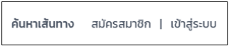

ภาพที่ 1 แถบเมนูผู้ใช้งานทั่วไป
1. สมัครสมาชิก สําหรับผู้ใช้ใหม่ที่ยังไม่มีบัญชี เพื่อสร้างบัญชีผู้ใช้งานก่อนเข้าใช้ระบบ
2. เข้าสู่ระบบ สําหรับผู้ใช้ที่มีบัญชีแล้ว ใช้กรอกชื่อผู้ใช้หรืออีเมลและรหัสผ่านเพื่อเข้าสู่ระบบ
3. ค้นหาเส้นทาง ใช้สําหรับค้นหาเส้นทางเดินทางที่ต้องการร่วมโดยสาร

### (1) เมนูเข้าสู่ระบบ กรณีเป็นผู้ใช้งานทั่วไป
การเข้าสู่ระบบของระบบ “ไปนําแหน่” สามารถทําได้จากแถบเมนูนําทาง มุมขวาบนของหน้า
เว็บไซต์ โดยผู้ใช้สามารถคลิกที่เมนู“เข้าสู่ระบบ” เพื่อเข้าสู่หน้าฟอร์มสําหรับกรอกชื่อผู้ใช้หรืออีเมลและรหัสผ่าน

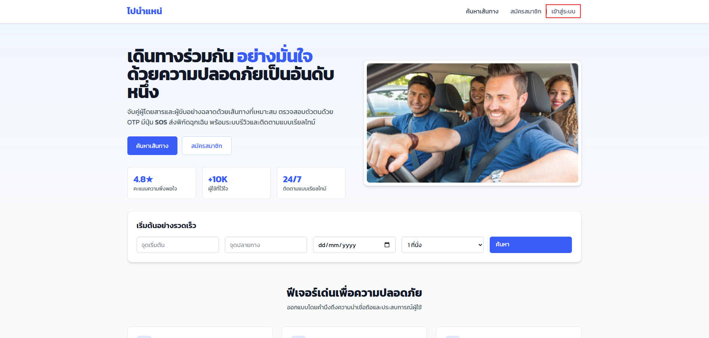

ภาพที่ 2 หน้าแรก และเมนูเข้าสู่ระบบ

จากภาพที่ 2 เมื่อคลิกเข้าสู่หน้าดังกล่าว ระบบจะแสดงแบบฟอร์มเข้าสู่ระบบตามที่ปรากฏในภาพที่
3 ซึ่งประกอบด้วยช่องสําหรับกรอกข้อมูล 2 ช่อง ได้แก่ ชื่อผู้ใช้หรืออีเมล และรหัสผ่าน ผู้ใช้จะต้องกรอกข้อมูลให้
ครบถ้วนและกดปุ่มเข้าสู่ระบบ หากกรอกข้อมูลถูกต้อง ระบบจะนําผู้ใช้เข้าสู่หน้าหลักของระบบตามสิทธิ์ของ
บทบาท (ผู้โดยสาร ผู้ขับขี่ หรือผู้ดูแลระบบ)

ในกรณีที่ยังไม่มีบัญชีผู้ใช้ สามารถคลิกที่ข้อความ “ยังไม่มีบัญชี? สมัครสมาชิก” ด้านล่างปุ่มเข้าสู่ระบบ เพื่อเข้าสู่หน้าสมัครสมาชิกได้ทันที

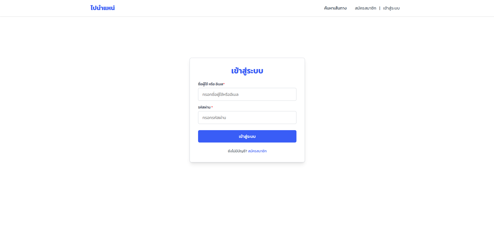

ภาพที่ 3 หน้าฟอร์มเข้าสู่ระบบ

จากภาพที่ 3 เป็นหน้าฟอร์มเข้าสู่ระบบที่ผู้ใช้งานทุกกลุ่มสามารถใช้เข้าสู่ระบบได้ โดยผู้ใช้ทั่วไป เช่น
ผู้โดยสารและผู้ขับขี่ จะต้องกรอกชื่อผู้ใช้หรืออีเมลและรหัสผ่านที่ได้ลงทะเบียนไว้ก่อนหน้าเพื่อทําการเข้าสู่ระบบ ใน
กรณีของผู้ดูแลระบบ สามารถใช้บัญชีสําหรับผู้ดูแลโดยเฉพาะได้ โดยชื่อผู้ใช้หรืออีเมลคือ admin123 หรือ
admin@example.com และใช้รหัสผ่าน 123456789 ในการเข้าสู่ระบบของผู้ดูแลระบบ

## (2) เมนูสมัครสมาชิก กรณีเป็นผู้ใช้งานทั่วไป
การสมัคสมาชิกของระบบ “ไปนําแหน่” สามารถทําได้จากแถบเมนูนําทาง มุมขวาบนของหน้า
เว็บไซต์ โดยผู้ใช้สามารถคลิกที่เมนู“สมัครสมาชิก” เพื่อเข้าสู่หน้าฟอร์มสําหรับกรอกข้อมูลผู้ใช้ใหม่ก่อนเริ่มใช้งานระบบ

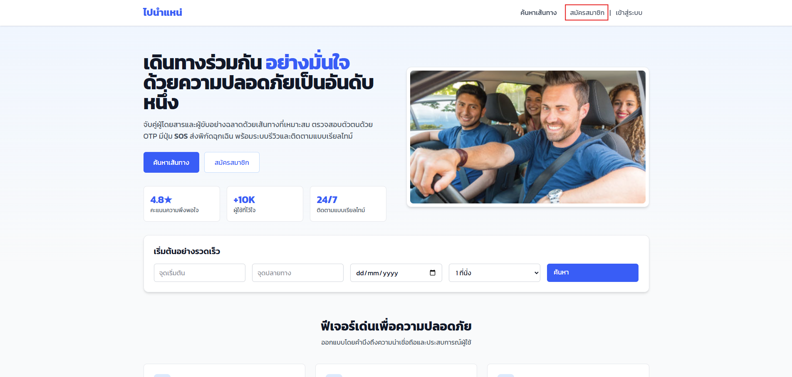

ภาพที่ 4 หน้าแรก และเมนูสมัครสมาชิก

จากภาพที่ 4 เมื่อคลิกเข้าสู่หน้าดังกล่าว ระบบจะแสดงแบบฟอร์มสมัครสมาชิกตามที่ปรากฏในภาพ
ที่ 5 ซึ่งประกอบด้วยขั้นตอนการกรอกข้อมูล 3 ส่วน ได้แก่ ข้อมูลบัญชีผู้ใช้ ข้อมูลส่วนตัว และการยืนยันตัวตน โดย
ผู้ใช้จําเป็นต้องกรอกข้อมูลครบถ้วนในแต่ละขั้นตอนก่อนดําเนินการต่อ

ภาพที่ 5 หน้าฟอร์มสมัครสมาชิก (ขั้นตอนที่ 1 – บัญชีผู้ใช้)

จากภาพที่ 5 เป็นขั้นตอนแรกของการสมัครสมาชิก ซึ่งผู้ใช้ต้องกรอกข้อมูลบัญชีผู้ใช้ เช่น ชื่อผู้ใช้
อีเมล รหัสผ่าน และการยืนยันรหัสผ่านอีกครั้ง โดยระบบกําหนดให้ชื่อผู้ใช้มีความยาวระหว่าง 4–20 ตัวอักษร และ
รหัสผ่านต้องมีความยาวไม่น้อยกว่า 8 ตัวอักษร ประกอบด้วยตัวอักษรภาษาอังกฤษและตัวเลข ผู้ใช้สามารถกดปุ่ม
“ถัดไป” เพื่อดําเนินการสู่ขั้นตอนต่อไป หรือกด “เข้าสู่ระบบ” หากมีบัญชีอยู่แล้ว

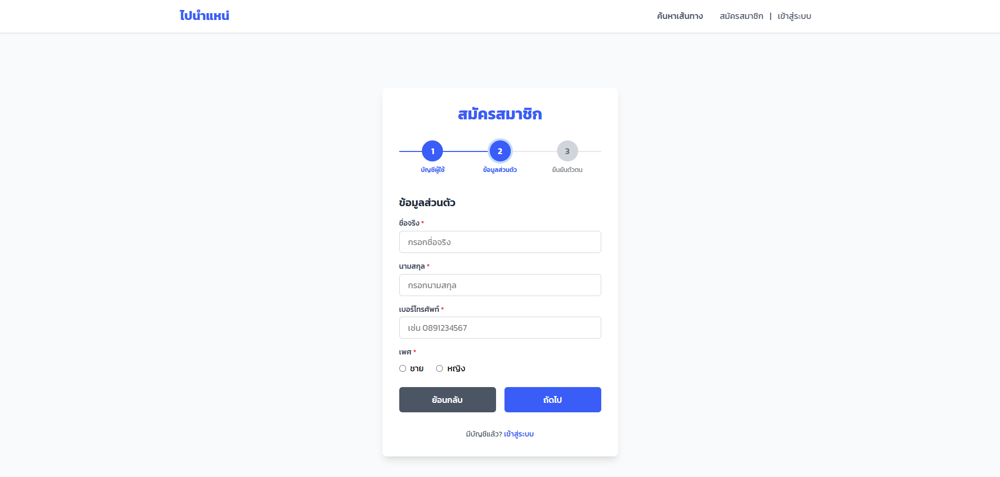

ภาพที่ 6 หน้าฟอร์มสมัครสมาชิก (ขั้นตอนที่ 2 – ข้อมูลส่วนตัว)

จากภาพที่ 6 แสดงขั้นตอนการกรอกข้อมูลส่วนตัวของผู้ใช้ ได้แก่ ชื่อจริง นามสกุล เบอร์โทรศัพท์
และเพศ โดยผู้ใช้ต้องกรอกข้อมูลให้ครบถ้วนในทุกช่องก่อนกดปุ่ม “ถัดไป” เพื่อเข้าสู่ขั้นตอนการยืนยันตัวตน ระบบ
จะบันทึกข้อมูลส่วนนี้ไว้ในฐานข้อมูลสําหรับใช้ระบุตัวตนของผู้ใช้ภายในระบบในภายหลัง

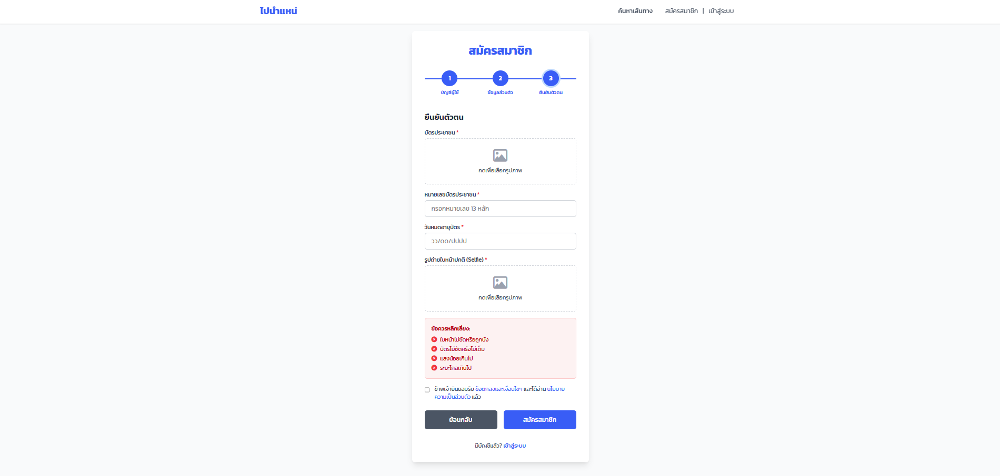

ภาพที่ 7 หน้าฟอร์มสมัครสมาชิก (ขั้นตอนที่ 3 – การยืนยันตัวตน)

จากภาพที่ 7 เป็นขั้นตอนสุดท้ายของการสมัครสมาชิก โดยผู้ใช้ต้องอัปโหลดรูปถ่ายบัตรประชาชน
หมายเลขบัตรประชาชน วันหมดอายุบัตร และรูปถ่ายใบหน้าตรง เพื่อยืนยันตัวตน ระบบกําหนดเงื่อนไขให้รูปถ่าย
ต้องเห็นใบหน้าชัดเจน ไม่ใส่หมวกหรือแว่นตา และไม่อยู่ในสภาพย้อนแสง เมื่อผู้ใช้ตรวจสอบข้อมูลครบถ้วนแล้ว
ให้ติ๊กยืนยัน “ข้าพเจ้ายินยอมรับเงื่อนไขการใช้งาน” ก่อนกดปุ่ม “สมัครสมาชิก” เพื่อบันทึกข้อมูลและสร้างบัญชี
ผู้ใช้ใหม่

## (3) เมนูค้นหาเส้นทาง กรณีเป็นผู้ใช้งานทั่วไป
การค้นหาเส้นทางของระบบ “ไปนําแหน่” สามารถทําได้จากแถบเมนูนําทาง (Navigation Bar) มุม
ขวาบนของหน้าเว็บไซต์ โดยผู้ใช้สามารถคลิกที่เมนู“ค้นหาเส้นทาง” เพื่อเข้าสู่หน้าค้นหาการเดินทาง

ภาพที่ 8 หน้าแรก และเมนูค้นหาเส้นทาง

จากภาพที่ 8 เมื่อคลิกเข้าสู่หน้าดังกล่าว จะแสดงเส้นทางที่ปรากฏตามในภาพที่ 9 จะมีช่องค้นหา
เส้นทางให้กรอก จุดเริ่มต้น จุดปลายทาง วันที่เดินทางและจํานวนที่นั่ง จากนั้นกดปุ่ม “ค้นหา” เพื่อแสดงผลเส้นทาง
ที่ตรงกับเงื่อนไข นอกจากนี้ ระบบยังมีฟังก์ชันการค้นหาที่ช่วยให้ผู้ใช้สามารถค้นหาเส้นทางได้แม่นยําและยืดหยุ่น
มากขึ้น โดยสามารถแสดงเส้นทางที่จุดเริ่มต้นหรือจุดปลาย ตรงกับตําแหน่งที่ค้นหา รวมถึงเส้นทางที่อยู่ใน รัศมีไม่
เกิน 500 เมตร จากตําแหน่งที่ระบุไว้

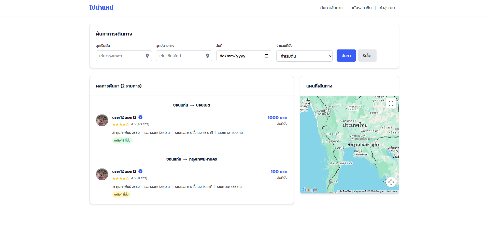

ภาพที่ 9 หน้าแรกของการค้นหาเส้นทาง

จากภาพที่ 9 เมื่อผู้ใช้เข้าสู่หน้าค้นหาเส้นทาง ระบบจะแสดงรายการเส้นทางที่ตรงกับเงื่อนไขการ
ค้นหา โดยแสดงข้อมูลสําคัญของแต่ละเส้นทาง เช่น ชื่อและภาพโปรไฟล์ของผู้ขับขี่ สัญลักษณ์ยืนยันตัวตน (หาก
ผ่านการตรวจสอบ) วันและเวลาที่ออกเดินทาง จุดเริ่มต้นและจุดปลายทาง ราคาต่อที่นั่ง ระยะทาง ระยะเวลา
โดยประมาณ และจํานวนที่นั่งที่ยังเหลืออยู่

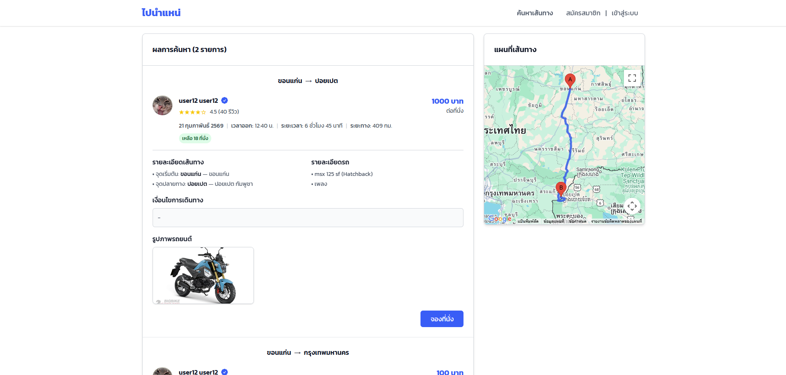

ภาพที่ 10 หน้ารายละเอียดเส้นทาง

จากภาพที่ 10 เมื่อผู้ใช้คลิกเลือกรายการเส้นทางที่ต้องการดู ระบบจะแสดงรายละเอียดของเส้นทาง
ที่เลือก รวมถึงข้อมูลเกี่ยวกับรถยนต์ที่ใช้ในการเดินทาง ผู้ใช้สามารถกดปุ่ม “จองที่นั่ง” เพื่อทําการจอง หากยังไม่ได้
เข้าสู่ระบบ ระบบจะนําไปยังหน้าล็อกอินโดยอัตโนมัติก่อนทําการจอง นอกจากนี้ทางด้านขวาของหน้าจอยังมีแผนที่
แสดงเส้นทางการเดินทาง เพื่อให้ผู้ใช้สามารถมองเห็นภาพรวมของเส้นทางได้ชัดเจนมากขึ้น

## เข้าใช้งานกรณีเป็นผู้โดยสาร
แถบเมนูหลัก กรณีเข้าสู่ระบบของผู้โดยสาร

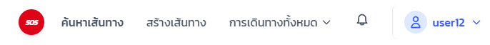

ภาพที่ 11 แถบเมนูผู้โดยสาร

จากภาพที่ 11 รายละเอียดแถบข้อมูลผู้โดยสาร
1. ปุ่ม SOS ขอความช่วยเหลือฉุกเฉิน
2. ค้นหาเส้นทาง
3. สร้างเส้นทาง
4. การเดินทางของฉัน
5. บัญชีของฉัน

## (1) เมนูขอความช่วยเหลือฉุกเฉิน กรณีเป็นผู้โดยสาร
ผู้โดยสารที่เข้าสู่ระบบสามารถขอความช่วยเหลือฉุกเฉินได้ เมื่อกดปุ่ม “SOS” ระบบ
จะแสดงหน้า SOS Emegency เพื่อให้ผู้โดยสารเลือกเบอร์ฉุกเฉิน เช่น ตำรวจ(191) พยาบาล(1669) สายด่วนจราจร(1197)

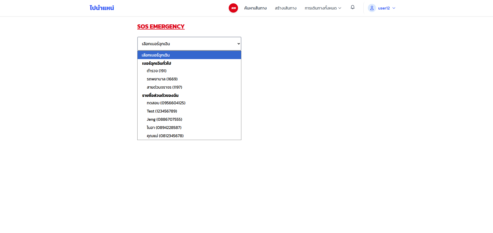

จากภาพที่ 12 หน้าขอความช่วยเหลือฉุกเฉิน

จากภาพที่ 12 เมื่อผู้ใช้คลิกเลือกรายการเบอร์โทรฉุกเฉินที่ต้องการ ระบบจะแสดงรายละเอียดของเบอร์โทร
ที่เลือก และปุ่มกด "CALL" สำหรับโทรไปเบอร์ที่เลือกไว้

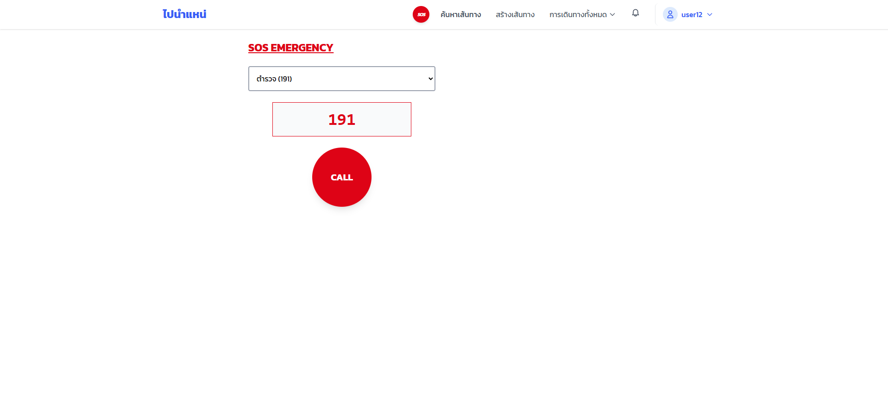

ภาพที่ 13 หน้ารายละเอียดเบอร์โทรฉุกเฉินและปุ่มกดโทรออก

## (2) เมนูยืนยันการจอง กรณีเป็นผู้โดยสาร
ผู้โดยสารที่เข้าสู่ระบบสามารถค้นหาเส้นทางที่ต้องการเดินทางร่วมได้ เมื่อกดปุ่ม “จองที่นั่ง” ระบบ
จะแสดงหน้าต่างยืนยันการจอง (Modal) เพื่อให้ผู้โดยสารกรอกข้อมูลรายละเอียดการจอง เช่น จํานวนที่นั่ง จุดรับ–
ส่ง และระบบจะแสดงราคารวมก่อนยืนยันการจอง

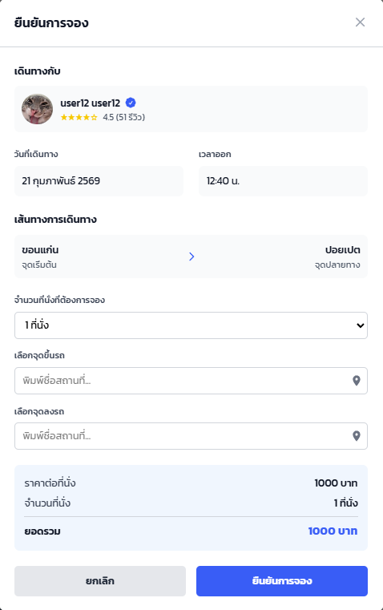

ภาพที่ 14 หน้าต่างยืนยันการจอง

จากภาพที่ 14 ผู้โดยสารสามารถกรอกข้อมูลรายละเอียดการจองได้ เช่น จํานวนที่นั่ง จุดรับ จุดส่ง
และยืนยันการจองเพื่อบันทึกข้อมูลในระบบ ทั้งนี้ หากผู้ใช้เป็นเจ้าของเส้นทางนั้นเอง ระบบจะไม่อนุญาตให้ทําการ
จองเส้นทางดังกล่าว

## (3) เมนูการเดินทางของฉัน กรณีเข้าสู่ระบบโดยผู้โดยสาร
ผู้โดยสารสามารถดูรายการเดินทางที่ได้จองไว้ทั้งหมดได้ในเมนู “การเดินทางของฉัน” ระบบจะ
แสดงข้อมูลเส้นทางที่จอง รวมถึงรายละเอียดผู้ขับขี่ วันที่ เวลา ราคา และแผนที่เส้นทาง

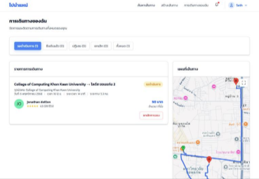

ภาพที่ 15 หน้าการเดินทางของฉัน

จากภาพที่ 15 ผู้โดยสารสามารถตรวจสอบสถานะการจองได้ เช่น “รอดําเนินการ” หรือ “ยืนยัน
แล้ว” และสามารถกดยกเลิกการจองได้ในกรณีที่ยังไม่เริ่มเดินทาง ดังภาพที่ 14 โดยเมื่อกดยกเลิก ระบบจะแสดง
หน้าต่างให้เลือกเหตุผลการยกเลิกตามที่กําหนดไว้ หากผู้โดยสารมีการกดยกเลิกการจองเกิน 3 ครั้ง ระบบจะ
กําหนดบทลงโทษไม่ให้ผู้โดยสารสามารถทําการจองเส้นทางใหม่ได้ภายในระยะเวลาที่ระบบกําหนด

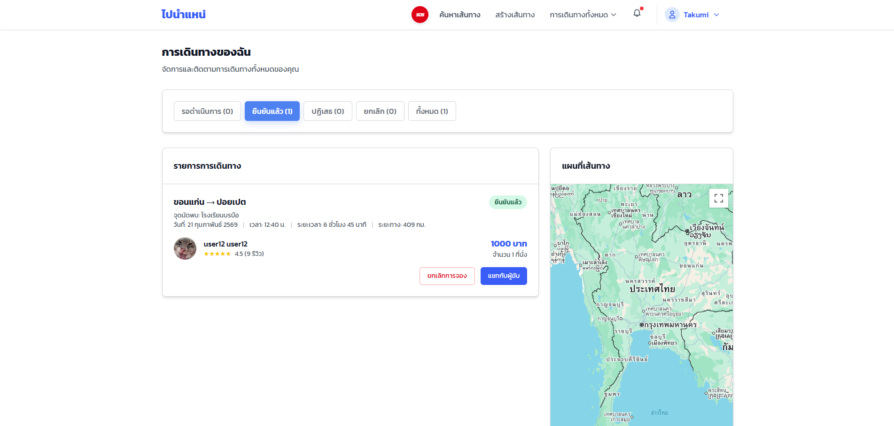

ภาพที่ 16 ปุ่มแชทกับผู้ขับ

จากภาพที่ 16 ผู้โดยสารสามารถแชทกับผู้ขับได้ ดังภาพที่ 17

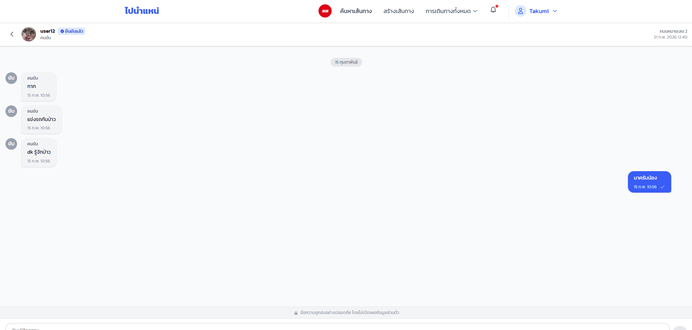

ภาพที่ 17 หน้าแชทกับผู้ขับ

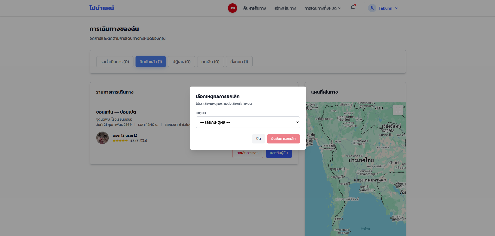

ภาพที่ 18 หน้าต่างเลือกเหตุผลการยกเลิก

## (4) เมนูบัญชีของฉัน กรณีเป็นผู้โดยสาร
แถบเมนูโปรไฟล์และการตั้งค่า

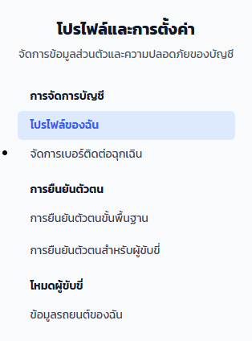

ภาพที่ 19 แถบเมนูจัดการข้อมูลส่วนตัวและความปลอดภัยของบัญชี

จากภาพที่ 19 รายละเอียดแถบข้อมูลผู้โดยสาร
1. โปรไฟล์ของฉัน
2. จัดการเบอร์ติดต่อฉุกเฉิน
3. การยืนยันตัวตนขั้นพื้นฐาน
4. การยืนยันตัวตนสําหรับผู้ขับขี่
5. ข้อมูลรถยนต์ของฉัน

## (5) โปรไฟล์ของฉัน กรณีเป็นผู้โดยสาร
ในแถบ “โปรไฟล์ของฉัน” ผู้ใช้สามารถดูและแก้ไขข้อมูลส่วนตัวของตนเองได้ เช่น รูปภาพโปรไฟล์
ชื่อนามสกุล อีเมล เบอร์โทรศัพท์ รวมถึงสามารถเปลี่ยนรหัสผ่านได้ด้วย

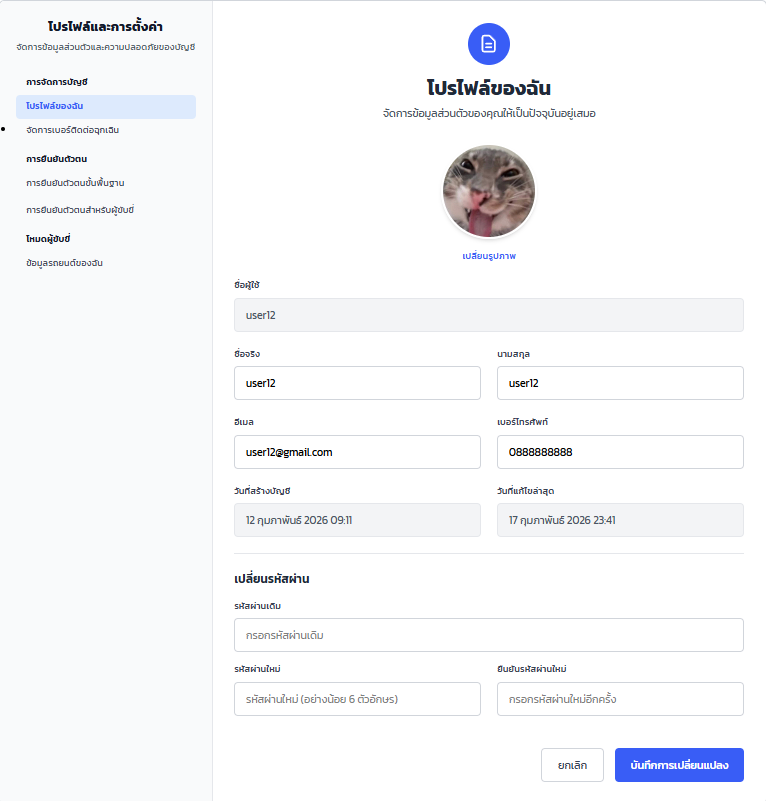

ภาพที่ 20 หน้าจอโปรไฟล์ของฉัน

จากภาพที่ 20 ผู้ใช้สามารถปรับปรุงข้อมูลส่วนตัวให้เป็นปัจจุบันได้อยู่เสมอ ทั้งข้อมูลทั่วไปและ
รหัสผ่าน เพื่อรักษาความปลอดภัยของบัญชี

## (6) จัดการเบอร์ติดต่อฉุกเฉิน กรณีเป็นผู้โดยสาร
ในแถบ “จัดการเบอร์ติดต่อฉุกเฉิน” ผู้ใช้สามารถดูและแก้ไขข้อมูลเบอร์ที่บันทึกได้

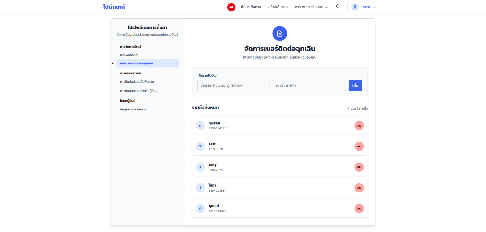

ภาพที่ 21 หน้าจัดการเบอร์ติดต่อฉุกเฉิน

จากภาพที่ 21 ผู้ใช้สามารถจัดการข้อมูลเบอร์ได้อยู่เสมอ

## (7) การยืนยันตัวตนขั้นพื้นฐาน กรณีเป็นผู้โดยสาร
ในแถบ “การยืนยันตัวตนขั้นพื้นฐาน” จะแสดงข้อมูลการยืนยันตัวตนของผู้ใช้ที่เคยส่งไว้ หากยังไม่
เคยยืนยัน ระบบจะแสดงข้อความ “ยังไม่มีประวัติการยืนยัน” พร้อมฟอร์มสําหรับอัปโหลดเอกสาร ได้แก่ ภาพถ่าย
บัตรประชาชนด้านหน้า และภาพถ่ายเซลฟีคู่กับบัตร เพื่อส่งเรื่องให้เจ้าหน้าที่ตรวจสอบ

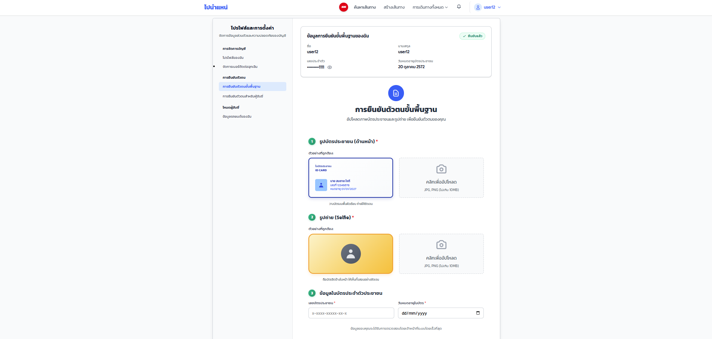

ภาพที่ 22 หน้าการยืนยันตัวตนขั้นพื้นฐาน

จากภาพที่ 22 ผู้ใช้สามารถอัปโหลดเอกสารเพื่อดําเนินการยืนยันตัวตนพื้นฐานได้ หากข้อมูลถูกต้อง
ระบบจะเปลี่ยนสถานะเป็น “ยืนยันแล้ว”

## (8) การยืนยันตัวตนสําหรับผู้ขับขี่กรณีเป็นผู้โดยสาร
ในแถบ “การยืนยันตัวตนสําหรับผู้ขับขี่” จะแสดงข้อมูลการยืนยันของผู้ขับขี่ที่เคยส่งไว้ หากยังไม่
เคยยืนยัน ระบบจะแสดงข้อความ “ยังไม่มีประวัติการยืนยันสําหรับผู้ขับขี่” และแสดงฟอร์มสําหรับอัปโหลดเอกสาร
ได้แก่ ภาพถ่ายใบขับขี่ ภาพเซลฟี และข้อมูลบนบัตรขับขี่ เพื่อใช้ตรวจสอบและอนุมัติสิทธิ์การเป็นผู้ขับขี่

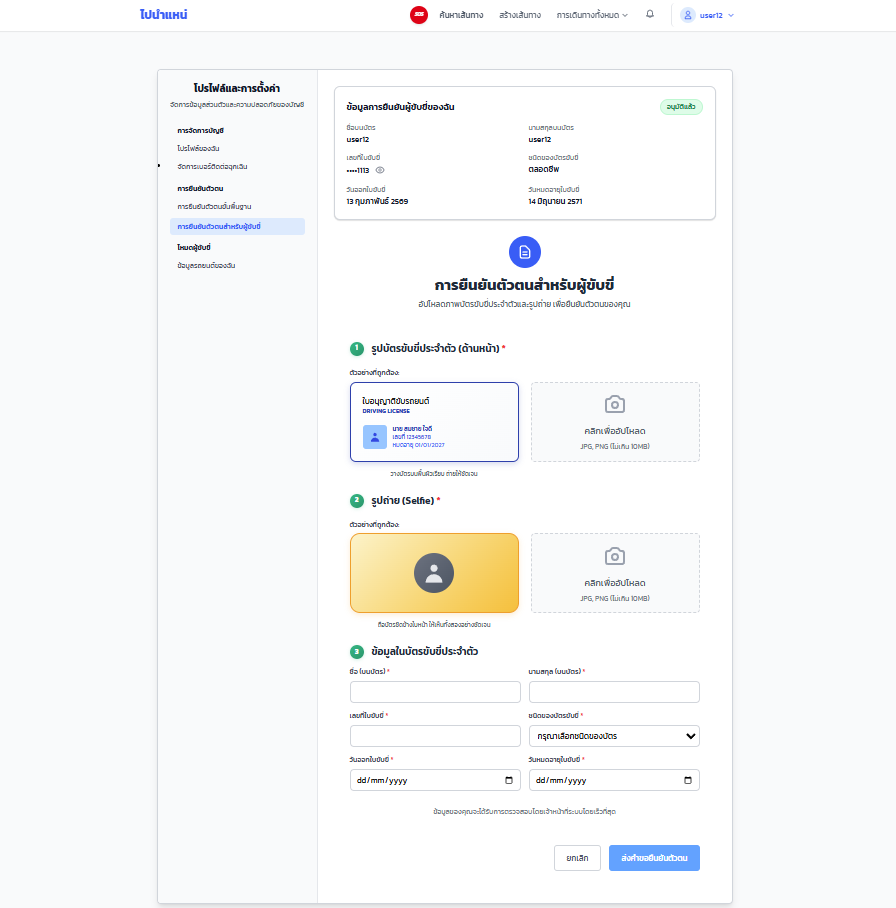

ภาพที่ 23 หน้าการยืนยันตัวตนสําหรับผู้ขับขี่

จากภาพที่ 23 ผู้ใช้สามารถอัปโหลดเอกสารเพื่อดําเนินการยืนยันตัวตนสําหรับผู้ขับขี่ได้ หากข้อมูล
ถูกต้อง ระบบจะเปลี่ยนสถานะเป็น “ยืนยันแล้ว”

# เข้าใช้งานกรณีเข้าสู่ระบบของผู้ขับขี่
แถบเมนูหลัก กรณีเข้าสู่ระบบของผู้ขับขี่

ภาพที่ 24 แถบเมนูผู้ขับขี่

จากภาพที่ 24 รายละเอียดแถบข้อมูลผู้ขับขี่

1. ปุ่ม SOS ขอความช่วยเหลือฉุกเฉิน
2. ค้นหาเส้นทาง
3. สร้างเส้นทาง
4. การเดินทางของฉัน
5. คําขอจองเส้นทางของฉัน
6. บัญชีของฉัน

## (1) เมนูขอความช่วยเหลือฉุกเฉิน กรณีเป็นผู้ขับขี่
ผู้ขับขี่ที่เข้าสู่ระบบสามารถขอความช่วยเหลือฉุกเฉินได้ เมื่อกดปุ่ม “SOS” ระบบ
จะแสดงหน้า SOS Emegency เพื่อให้ผู้โดยสารเลือกเบอร์ฉุกเฉิน เช่น ตำรวจ(191) พยาบาล(1669) สายด่วนจราจร(1197)

จากภาพที่ 25 หน้าขอความช่วยเหลือฉุกเฉิน

จากภาพที่ 25 เมื่อผู้ใช้คลิกเลือกรายการเบอร์โทรฉุกเฉินที่ต้องการ ระบบจะแสดงรายละเอียดของเบอร์โทร
ที่เลือก และปุ่มกด "CALL" สำหรับโทรไปเบอร์ที่เลือกไว้

ภาพที่ 26 หน้ารายละเอียดเบอร์โทรฉุกเฉินและปุ่มกดโทรออก

# (2) เมนูยืนยันการจอง กรณีเป็นผู้ขับขี่
ผู้ขับขี่ที่เข้าสู่ระบบสามารถค้นหาเส้นทางที่ต้องการเดินทางร่วมได้ เมื่อกดปุ่ม “จองที่นั่ง” ระบบจะ
แสดงหน้าต่างยืนยันการจอง (Modal) เพื่อให้ผู้ขับขี่กรอกข้อมูลรายละเอียดการจอง เช่น จํานวนที่นั่ง จุดรับ–ส่ง
และระบบจะแสดงราคารวมก่อนยืนยันการจอง

ภาพที่ 26 หน้าต่างยืนยันการจอง

จากภาพที่ 26 ผู้ขับขี่สามารถกรอกข้อมูลรายละเอียดการจองได้ เช่น จํานวนที่นั่ง จุดรับ จุดส่ง และ
ยืนยันการจองเพื่อบันทึกข้อมูลในระบบ ทั้งนี้ หากผู้ใช้เป็นเจ้าของเส้นทางนั้นเอง ระบบจะไม่อนุญาตให้ทําการจอง
เส้นทางดังกล่าว

# (3) เมนูสร้างเส้นทาง กรณีเข้าสู่ระบบโดยผู้ขับขี่
ผู้ขับขี่สามารถสร้างเส้นทางของตนเองได้ โดยกรอกข้อมูลจุดเริ่มต้นและจุดปลายทาง รวมถึง
รายละเอียดการเดินทาง เช่น วันที่ เวลา ราคา และจํานวนที่นั่งว่าง

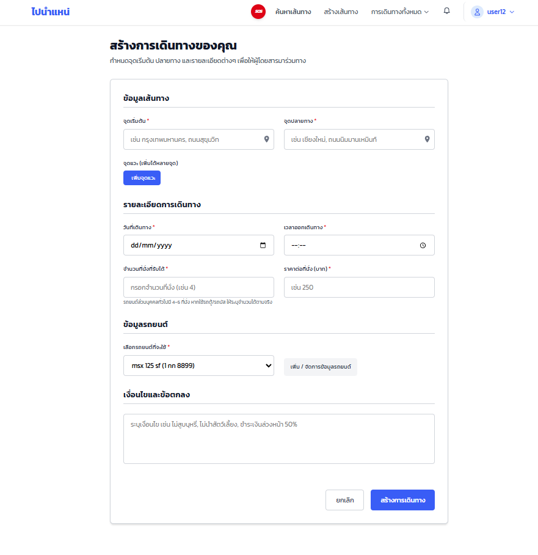

ภาพที่ 27 หน้าสร้างเส้นทางของผู้ขับขี่

จากภาพที่ 27 ผู้ขับขี่สามารถกรอกข้อมูลเส้นทาง รายละเอียดการเดินทาง และข้อมูลรถยนต์ก่อน
กดปุ่ม “สร้างการเดินทาง” เพื่อเผยแพร่เส้นทางให้ผู้โดยสารสามารถค้นหาได้หากผู้ขับขี่ยังไม่เคยผ่านการยืนยัน
ตัวตน ระบบจะนําไปยังหน้าฟอร์มยืนยันตัวตนผู้ขับขี่ก่อน

# (4) เมนูคําขอจองเส้นทางของฉัน กรณีเข้าสู่ระบบโดยผู้ขับขี่
ผู้ขับขี่สามารถดูคําขอจองเส้นทางที่มีผู้โดยสารส่งเข้ามาในเมนู “คําขอจองเส้นทางของฉัน” โดย
ระบบจะแสดงข้อมูลเส้นทางที่ผู้ขับขี่สร้างไว้ พร้อมรายชื่อผู้โดยสารที่ทําการจอง สามารถกดยืนยันหรือปฏิเสธคําขอได้

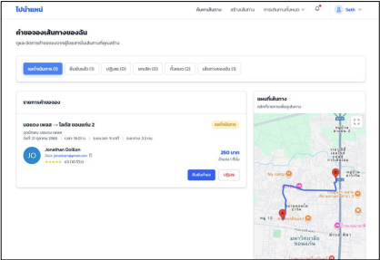

ภาพที่ 28 หน้าคําขอจองเส้นทางของฉัน

จากภาพที่ 28 ผู้ขับขี่สามารถตรวจสอบรายละเอียดของผู้โดยสารและเส้นทาง พร้อมจัดการสถานะ
คําขอ เช่น “ยืนยันคําขอ” หรือ “ปฏิเสธ” ได้ทันทีและผู้ขับขี่สามารถใช้ตัวกรอง “เส้นทางของฉัน” ดังภาพที่ 29
เพื่อดูภาพรวมของทุกเส้นทางที่สร้างไว้ในระบบ พร้อมตรวจสอบสถานะปัจจุบัน เช่น เส้นทางที่เต็มแล้ว

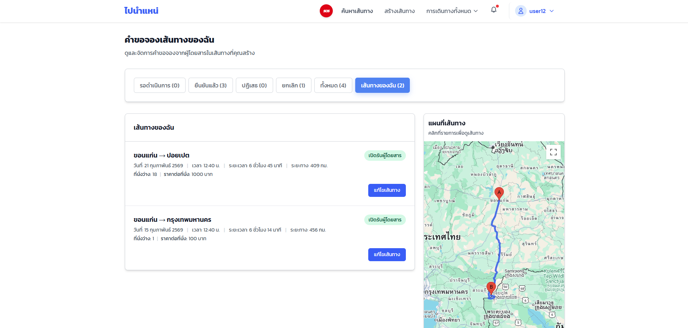

ภาพที่ 29 หน้าคําขอจองเส้นทางของฉัน กรอง “เส้นทางของฉัน”

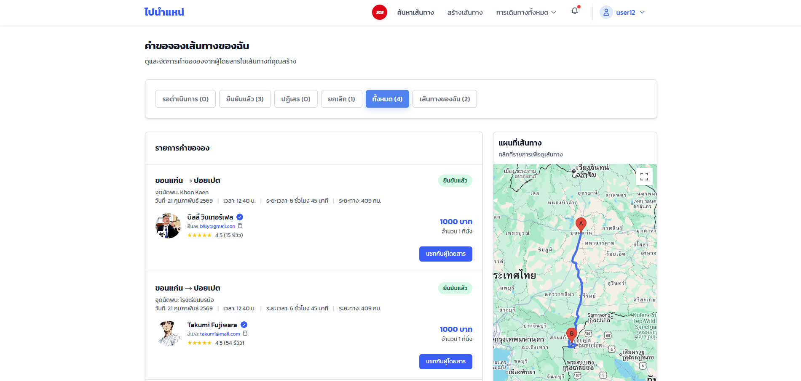

ภาพที่ 30 หน้าแสดงการจองเส้นทางของฉันทั้งหมด

จากภาพที่ 30 เมื่อกดปุ่ม แชทกับผู้โดยสาร จะแสดงหน้าดั่งภาพที่ 31

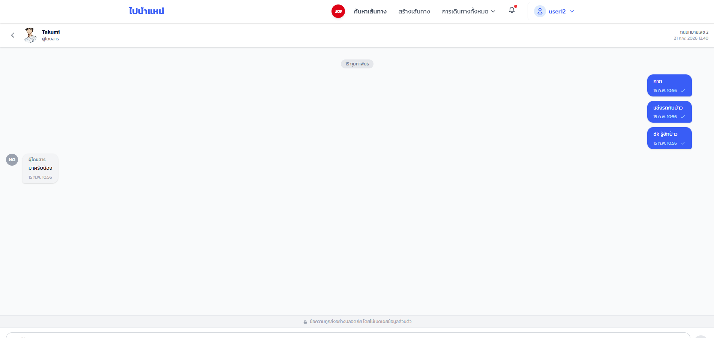

ภาพที่ 31 หน้าแชทกับโดยสาร

# (5) เมนูบัญชีของฉัน กรณีเป็นผู้ขับขี่
แถบเมนูโปรไฟล์และการตั้งค่า

ภาพที่ 32 แถบเมนูจัดการข้อมูลส่วนตัวและความปลอดภัยของบัญชี

จากภาพที่ 32 รายละเอียดแถบข้อมูลผู้ขับขี่

1. โปรไฟล์ของฉัน
2. จัดการเบอร์ติดต่อฉุกเฉิน
3. การยืนยันตัวตนขั้นพื้นฐาน
4. การยืนยันตัวตนสําหรับผู้ขับขี่
5. ข้อมูลรถยนต์ของฉัน

## (6) โปรไฟล์ของฉัน กรณีเป็นผู้โดยสาร
ในแถบ “โปรไฟล์ของฉัน” ผู้ใช้สามารถดูและแก้ไขข้อมูลส่วนตัวของตนเองได้ เช่น รูปภาพโปรไฟล์
ชื่อนามสกุล อีเมล เบอร์โทรศัพท์ รวมถึงสามารถเปลี่ยนรหัสผ่านได้ด้วย

ภาพที่ 33 หน้าจอโปรไฟล์ของฉัน

จากภาพที่ 33 ผู้ใช้สามารถปรับปรุงข้อมูลส่วนตัวให้เป็นปัจจุบันได้อยู่เสมอ ทั้งข้อมูลทั่วไปและ
รหัสผ่าน เพื่อรักษาความปลอดภัยของบัญชี

## (7) จัดการเบอร์ติดต่อฉุกเฉิน กรณีเป็นผู้โดยสาร
ในแถบ “จัดการเบอร์ติดต่อฉุกเฉิน” ผู้ใช้สามารถดูและแก้ไขข้อมูลเบอร์ที่บันทึกได้

ภาพที่ 34 หน้าจัดการเบอร์ติดต่อฉุกเฉิน

จากภาพที่ 34 ผู้ใช้สามารถจัดการข้อมูลเบอร์ได้อยู่เสมอ

## (8) การยืนยันตัวตนขั้นพื้นฐาน กรณีเป็นผู้โดยสาร
ในแถบ “การยืนยันตัวตนขั้นพื้นฐาน” จะแสดงข้อมูลการยืนยันตัวตนของผู้ใช้ที่เคยส่งไว้ หากยังไม่
เคยยืนยัน ระบบจะแสดงข้อความ “ยังไม่มีประวัติการยืนยัน” พร้อมฟอร์มสําหรับอัปโหลดเอกสาร ได้แก่ ภาพถ่าย
บัตรประชาชนด้านหน้า และภาพถ่ายเซลฟีคู่กับบัตร เพื่อส่งเรื่องให้เจ้าหน้าที่ตรวจสอบ

ภาพที่ 35 หน้าการยืนยันตัวตนขั้นพื้นฐาน

จากภาพที่ 35 ผู้ใช้สามารถอัปโหลดเอกสารเพื่อดําเนินการยืนยันตัวตนพื้นฐานได้ หากข้อมูลถูกต้อง
ระบบจะเปลี่ยนสถานะเป็น “ยืนยันแล้ว”

## (9) การยืนยันตัวตนสําหรับผู้ขับขี่กรณีเป็นผู้โดยสาร
ในแถบ “การยืนยันตัวตนสําหรับผู้ขับขี่” จะแสดงข้อมูลการยืนยันของผู้ขับขี่ที่เคยส่งไว้ หากยังไม่
เคยยืนยัน ระบบจะแสดงข้อความ “ยังไม่มีประวัติการยืนยันสําหรับผู้ขับขี่” และแสดงฟอร์มสําหรับอัปโหลดเอกสาร
ได้แก่ ภาพถ่ายใบขับขี่ ภาพเซลฟี และข้อมูลบนบัตรขับขี่ เพื่อใช้ตรวจสอบและอนุมัติสิทธิ์การเป็นผู้ขับขี่

ภาพที่ 36 หน้าการยืนยันตัวตนสําหรับผู้ขับขี่

จากภาพที่ 36 ผู้ใช้สามารถอัปโหลดเอกสารเพื่อดําเนินการยืนยันตัวตนสําหรับผู้ขับขี่ได้ หากข้อมูล
ถูกต้อง ระบบจะเปลี่ยนสถานะเป็น “ยืนยันแล้ว”

# (10) ข้อมูลรถยนต์ของฉัน กรณีเป็นผู้ขับขี่
ในแถบ “ข้อมูลรถยนต์ของฉัน” ผู้ขับขี่สามารถดูข้อมูลรถยนต์ที่มีอยู่ แก้ไข หรือลบออกได้ รวมถึง
สามารถเพิ่มรถคันใหม่ได้โดยกดปุ่ม “เพิ่ม / จัดการข้อมูล”

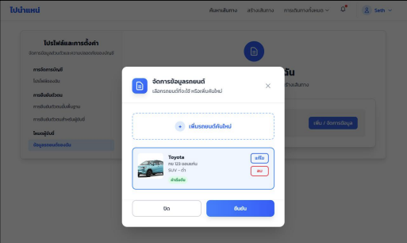

ภาพที่ 37 หน้าการจัดการข้อมูลรถยนต์

จากภาพที่ 37 ระบบจะแสดงรายการรถยนต์ที่ผู้ขับขี่มีอยู่ หากต้องการเพิ่มรถยนต์ใหม่ ให้กดปุ่ม
“เพิ่มรถยนต์คันใหม่” ระบบจะแสดงฟอร์ม ดังภาพที่ 38 สําหรับกรอกรายละเอียดรถยนต์ เช่น ยี่ห้อ รุ่น หมายเลข
ทะเบียน สี จํานวนที่นั่ง สิ่งอํานวยความสะดวก และรูปภาพรถยนต์

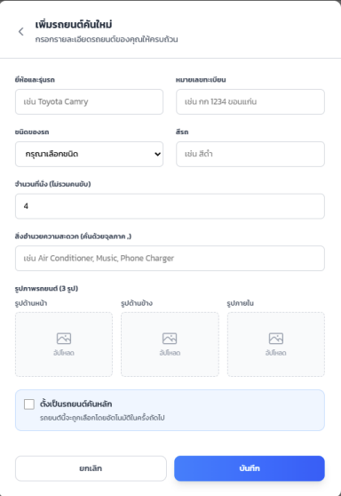

ภาพที่ 38 หน้าการเพิ่มข้อมูลรถยนต์ใหม่

จากภาพที่ 38 ผู้ใช้สามารถกรอกข้อมูลและอัปโหลดรูปภาพรถยนต์ทั้ง 3 มุม (ด้านหน้า ด้านข้างภายใน) พร้อมเลือกตั้งให้เป็น “รถยนต์คันหลัก” ได้

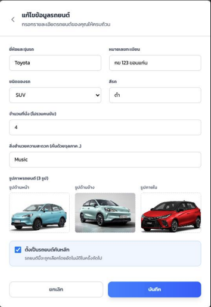

ภาพที่ 39 หน้าการแก้ไขข้อมูลรถยนต์

จากภาพที่ 39 หากผู้ขับขี่ต้องการแก้ไขข้อมูลรถยนต์ สามารถปรับเปลี่ยนรายละเอียดได้ เช่น สีรถ สิ่งอํานวยความสะดวก หรือเปลี่ยนรูปภาพใหม่ แล้วกด “บันทึก” เพื่ออัปเดตข้อมูลในระบบ

## เข้าใช้งานกรณีเข้าสู่ระบบของผู้ดูแลระบบ
แถบเมนูหลัก กรณีเข้าสู่ระบบของผู้โดยสารและผู้ขับขี่

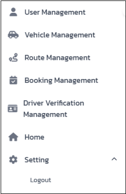

ภาพที่ 40 แสดงแถบเมนูผู้ดูแลระบบทั้งหมด

จากภาพที่ 40 รายละเอียดแถบผู้ดูแลระบบ

1. User Management จัดการผู้ใช้งานทั้งหมดในระบบ
2. Vehicle Management จัดการข้อมูลรถยนต์ของผู้ขับขี่
3. Route Management จัดการเส้นทางการเดินทาง
4. Booking Management จัดการคําขอจองที่เกิดขึ้นในระบบ
5. Driver Verification Management ตรวจสอบและอนุมัติการยืนยันตัวตนของผู้ขับขี่

# (1) เมนูการจัดการผู้ใช้กรณีเป็นผู้ดูแลระบบ

ผู้ดูแลระบบสามารถดูรายชื่อผู้ใช้ทั้งหมดในระบบได้ โดยแต่ละแถวแสดงข้อมูลพื้นฐาน เช่น ชื่อผู้ใช้
อีเมล บทบาท (Role) สถานะการยืนยันตัวตน และสถานะการใช้งาน (Active) รวมถึงมีปุ่มสําหรับเพิ่ม แก้ไข หรือ
ลบข้อมูลของผู้ใช้ในระบบได้โดยตรง

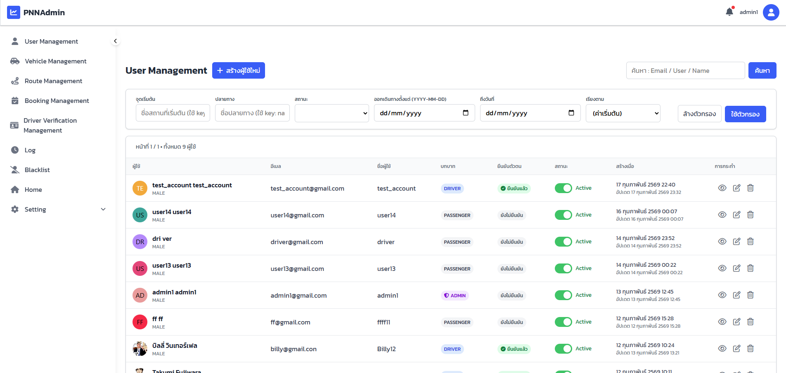

ภาพที่ 41 หน้าการจัดการผู้ใช้

จากภาพที่ 41 เมื่อกดปุ่ม “สร้างผู้ใช้ใหม่”จะเป็นหน้าสําหรับสร้างบัญชีผู้ใช้ใหม่ ดังภาพที่ 33 ผู้ดูแล
ระบบสามารถกรอกข้อมูลได้ทั้งส่วนบัญชี (อีเมล รหัสผ่าน ชื่อผู้ใช้ เบอร์โทรศัพท์) และข้อมูลส่วนตัว (ชื่อจริง–
นามสกุล เพศ เลขบัตรประชาชน วันหมดอายุบัตร และอัปโหลดรูปบัตรประชาชน/เซลฟี) โดยสามารถกําหนด
บทบาท (Role) ได้เป็น Passenger, Driver หรือ Admin

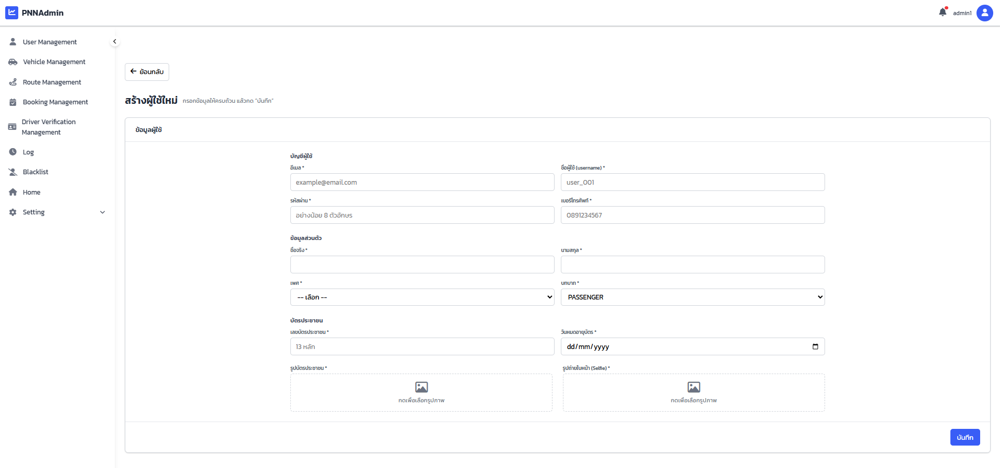

ภาพที่ 42 หน้าสร้างผู้ใช้ใหม่

จากภาพที่ 42 เมื่อกดปุ่ม “รายละเอียด”จะเป็นเป็นหน้าสําหรับดูรายละเอียดของผู้ใช้ที่เลือกไว้ ดังภาพที่ 39 
ระบบจะแสดงข้อมูลทั้งหมดของผู้ใช้ รวมถึงสามารถตั้งค่าสถานะการยืนยันตัวตนได้จากหน้านี้ได้โดยตรง
หลังจากผู้ดูแลตรวจสอบเอกสาร และหากข้อมูลไม่ถูกต้องหรือไม่เรียบร้อย ผู้ดูแลสามารส่งการแจ้งเตือนถึงผู้ใช้

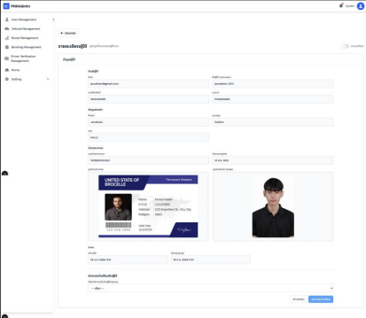

ภาพที่ 43 หน้ารายละเอียดผู้ใช้

จากภาพที่ 43 เมื่อกดปุ่ม “แก้ไข”จะเป็นเป็นหน้าสําหรับแก้ไขข้อมูลของผู้ใช้ที่เลือกมา ดังภาพที่ 44
โดยฟอร์มจะแสดงข้อมูลเดิมทั้งหมด ผู้ดูแลสามารถแก้ไขข้อมูลบางส่วน เช่น เบอร์โทรศัพท์ ชื่อ–นามสกุล บทบาท
หรือวันหมดอายุบัตร แล้วกด “บันทึก” เพื่ออัปเดตข้อมูลในระบบ

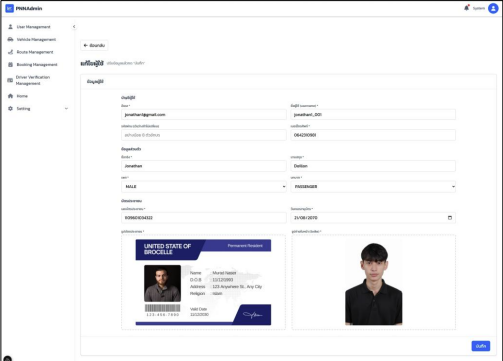

ภาพที่ 44 หน้าแก้ไขข้อมูลผู้ใช้

# (2) เมนูการจัดการรถยนต์กรณีเป็นผู้ดูแลระบบ
ผู้ดูแลระบบสามารถดูรายการรถยนต์ทั้งหมดที่ถูกเพิ่มเข้าระบบได้ โดยแต่ละแถวแสดงข้อมูลพื้นฐาน
เช่น ชื่อยี่ห้อ รุ่น สี หมายเลขทะเบียน เจ้าของรถ และสถานะ “ค่าเริ่มต้น” ของรถยนต์ผู้ดูแลสามารถค้นหา
กรองข้อมูล และจัดเรียงลําดับยานรถยนต์ได้ตามต้องการ รวมถึงมีปุ่มสําหรับเพิ่ม แก้ไข หรือลบข้อมูลรถยนต์ของ
ผู้ใช้ในระบบได้โดยตรง

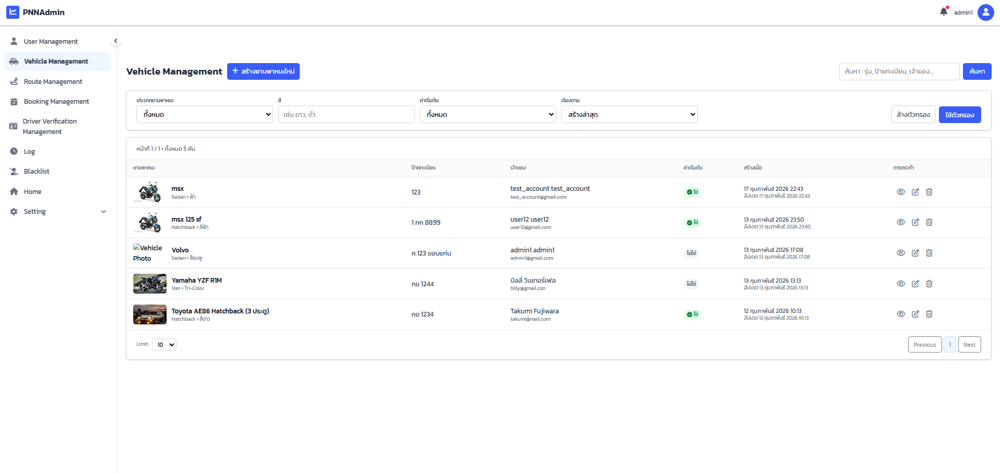

ภาพที่ 45 หน้าการจัดการรถยนต์

จากภาพที่ 45 เมื่อกดปุ่ม “สร้างยานพาหนะใหม่” จะเป็นหน้าสําหรับกรอกแบบฟอร์มเพิ่มข้อมูลรถยนต์ของผู้ใช้ดังภาพที่ 42

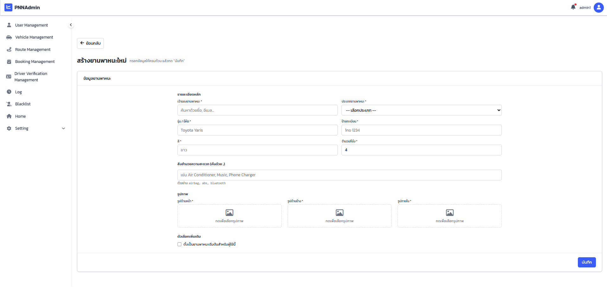

ภาพที่ 46 หน้าสร้างรถยนต์ใหม่

จากภาพที่ 46 เมื่อเลือกปุ่ม “ดูรายละเอียด” จะเข้าสู่หน้ารายละเอียดของรถยนต์ที่เลือกไว้ ดังภาพ
ที่ 47 โดยจะแสดงข้อมูลทั้งหมด เช่น ยี่ห้อ รุ่น สี ประเภท หมายเลขทะเบียน จํานวนที่นั่ง ชื่อและอีเมลเจ้าของรถ
รวมถึงรูปภาพของรถแต่ละมุม (ด้านหน้า ด้านข้าง ภายใน) เพื่อให้ผู้ดูแลระบบสามารถตรวจสอบความถูกต้องของ
ข้อมูลได้หรือแก้ไขเพิ่มเติม

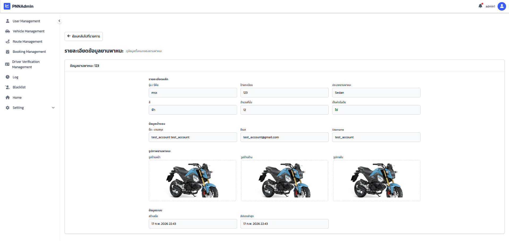

ภาพที่ 47 หน้ารายละเอียดข้อมูลยานพาหนะ

จากภาพที่ 47 เมื่อกดปุ่ม “แก้ไข” จะเป็นหน้าสําหรับแก้ไขข้อมูลของยานพาหนะที่เลือกไว้ ดังภาพที่ 44 
ฟอร์มจะแสดงข้อมูลเดิมทั้งหมด ผู้ดูแลระบบสามารถปรับแก้รายละเอียด เช่น สี จํานวนที่นั่ง รูปภาพ หรือ
การตั้งค่าให้เป็นรถเริ่มต้นของผู้ใช้ จากนั้นกด “บันทึกการเปลี่ยนแปลง” เพื่ออัปเดตข้อมูลในระบบ

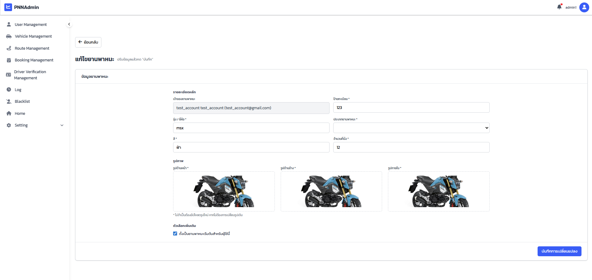

ภาพที่ 48 หน้าแก้ไขข้อมูลรถยนต์

# (3) เมนูการจัดการเส้นทาง กรณีเป็นผู้ดูแลระบบ
ผู้ดูแลระบบสามารถตรวจสอบรายการเส้นทางทั้งหมดที่มีอยู่ในระบบได้ โดยแต่ละแถวของข้อมูลจะ
แสดงรายละเอียดพื้นฐาน เช่น จุดเริ่มต้นและปลายทางของเส้นทาง ชื่อผู้ขับขี่ ยานพาหนะที่ใช้ วันที่และเวลาที่ออก
เดินทาง จํานวนที่นั่ง ราคาต่อที่นั่ง และสถานะของเส้นทาง ผู้ดูแลระบบสามารถค้นหาเส้นทางที่ต้องการได้จากช่อง
ค้นหาด้านบน หรือกรองข้อมูลตามช่วงวันที่ สถานะ หรือคําค้นหาที่ระบุได้ รวมถึงมีปุ่มสําหรับเพิ่ม แก้ไข หรือลบ
ข้อมูลเส้นทางของผู้ใช้ในระบบได้โดยตรง

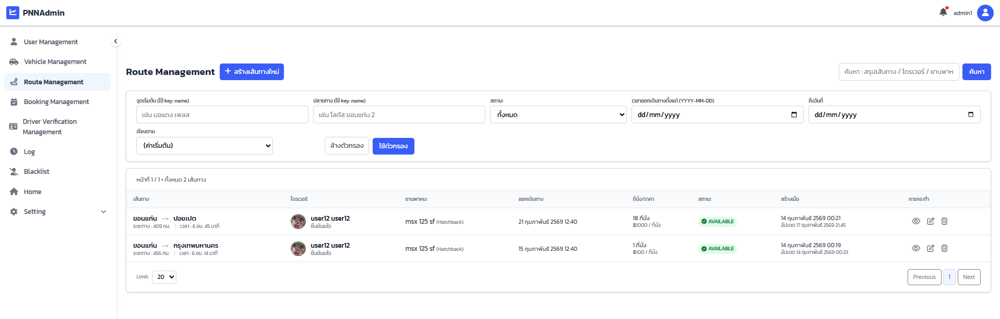

ภาพที่ 49 หน้าการจัดการเส้นทาง

จากภาพที่ 49 เมื่อเลือกปุ่ม “สร้างเส้นทางใหม่” จะเข้าสู่หน้าสําหรับสร้างเส้นทางให้กับผู้ขับขี่ ดังภาพที่ 46 โดยผู้ดูแลระบบสามารถเลือกผู้ขับขี่และรถยนต์ที่ต้องการสร้างเส้นทางให้ได้ รวมถึงสามารถกําหนด
จุดเริ่มต้นและปลายทางของเส้นทางผ่านแผนที่ของ Google Maps ซึ่งสามารถระบุจุดแวะระหว่างทางเพิ่มเติม
นอกจากนี้ยังสามารถระบุวันที่ออกเดินทาง เวลาที่ต้องการเดินทาง ราคาต่อที่นั่ง จํานวนที่นั่ง และเงื่อนไขการ
เดินทาง จากนั้นกดปุ่ม “สร้างเส้นทาง” เพื่อบันทึกข้อมูลเข้าสู่ระบบ

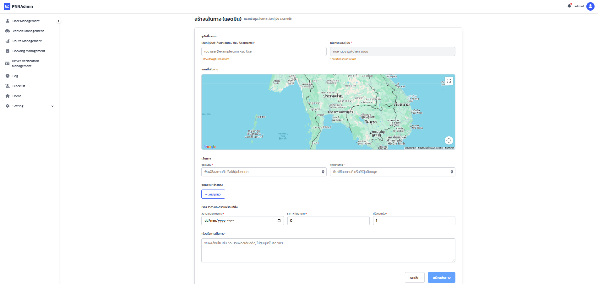

ภาพที่ 50 หน้าสร้างเส้นทางใหม่

จากภาพที่ 50 เมื่อเลือกปุ่ม “แก้ไข” จะเข้าสู่หน้าสําหรับปรับแก้ข้อมูลเส้นทางที่มีอยู่ในระบบ ดังภาพที่ 47 
โดยจะแสดงข้อมูลเดิมของเส้นทางที่เลือกไว้ เช่น ชื่อสถานที่ พิกัดของต้นทางและปลายทาง วันที่ออก
เดินทาง ราคา และจํานวนที่นั่ง ผู้ดูแลระบบสามารถปรับเปลี่ยนรายละเอียดตามต้องการ และกดปุ่ม “บันทึกการ
เปลี่ยนแปลง” เพื่ออัปเดตข้อมูลในระบบให้เป็นปัจจุบัน

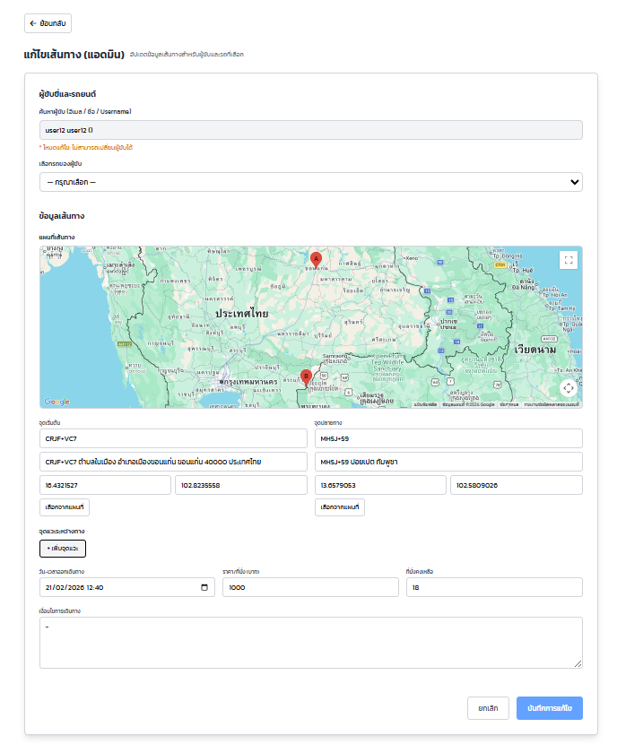

ภาพที่ 51 หน้าแก้ไขเส้นทาง

จากภาพที่ 51 เมื่อเลือกปุ่ม “ดูรายละเอียด” จะเข้าสู่หน้ารายละเอียดของเส้นทางที่เลือกไว้ ดังภาพที่ 48 
โดยหน้าดังกล่าวจะแสดงแผนที่เส้นทางจริงพร้อมจุดเริ่มต้นและปลายทาง ข้อมูลระยะทาง เวลาโดยประมาณ
ราคา จํานวนที่นั่ง และข้อมูลผู้ขับขี่ที่เกี่ยวข้อง รวมถึงรายละเอียดของรถยนต์และรูปภาพประกอบ เพื่อให้ผู้ดูแล
ระบบสามารถตรวจสอบข้อมูลทั้งหมดของเส้นทางได้อย่างครบถ้วนและถูกต้องก่อนดําเนินการอื่นต่อไป

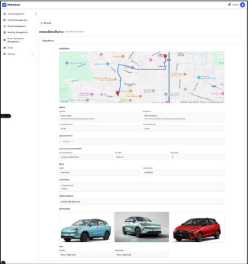

ภาพที่ 52 หน้ารายละเอียดเส้นทาง

# (4) เมนูการจัดการการจอง กรณีเป็นผู้ดูแลระบบ
ผู้ดูแลระบบสามารถตรวจสอบรายการการจองทั้งหมดที่มีอยู่ในระบบได้ โดยแต่ละรายการจะแสดง
ข้อมูลพื้นฐาน เช่น ชื่อผู้โดยสาร เส้นทางที่ทําการจอง จุดรับ–จุดส่ง วันที่และเวลาที่ออกเดินทาง จํานวนที่นั่ง และ
สถานะของการจอง เช่น “PENDING”, “CONFIRMED” หรือ “CANCELLED” ผู้ดูแลระบบสามารถค้นหาการจองที่
ต้องการได้จากช่องค้นหาด้านบน หรือกรองข้อมูลตามช่วงวันที่ สถานะ หรือคําค้นหาเฉพาะ รวมถึงมีปุ่มสําหรับเพิ่ม
แก้ไข หรือลบข้อมูลการจองของผู้ใช้ในระบบได้โดยตรง

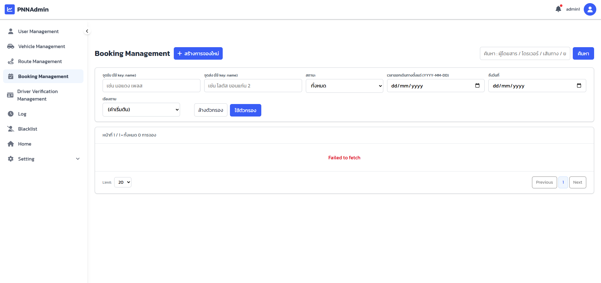

ภาพที่ 53 หน้าการจัดการการจอง

จากภาพที่ 53 เมื่อเลือกปุ่ม “สร้างการจองใหม่” จะเข้าสู่หน้าสําหรับสร้างการจองให้กับผู้ใช้ใน
ระบบ ดังภาพที่ 54 โดยผู้ดูแลระบบสามารถเลือกเส้นทางและผู้โดยสารจากรายชื่อที่มีอยู่ในระบบ รวมถึงกําหนด
จํานวนที่นั่ง จุดขึ้นรถ และจุดลงรถ เพื่อให้ตรงตามข้อมูลของเส้นทางที่เลือก เมื่อกรอกข้อมูลครบถ้วนแล้วสามารถ
กดปุ่ม “สร้างการจอง” เพื่อบันทึกข้อมูลเข้าสู่ระบบ

ภาพที่ 55 หน้าสร้างการจองใหม่

จากภาพที่ 55 เมื่อเลือกปุ่ม “แก้ไข” จะเข้าสู่หน้าสําหรับปรับแก้ข้อมูลของการจองที่เลือกไว้ดังภาพ
ที่ 56 โดยในหน้าดังกล่าวจะแสดงข้อมูลเดิมของการจอง เช่น เส้นทางที่เลือก ผู้โดยสารที่ทําการจอง จํานวนที่นั่ง จุด
รับ และจุดส่ง ผู้ดูแลระบบสามารถแก้ไขรายละเอียดที่ต้องการ และกดปุ่ม “บันทึกการเปลี่ยนแปลง” เพื่ออัปเดต
ข้อมูลการจองในระบบให้เป็นปัจจุบัน

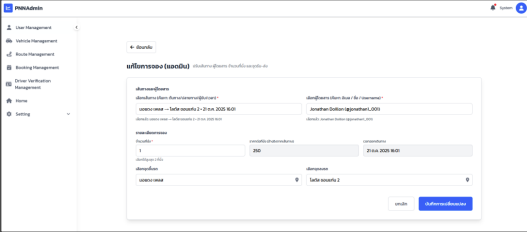

ภาพที่ 56 หน้าแก้ไขการจอง

จากภาพที่ 56 เมื่อเลือกปุ่ม “ดูรายละเอียด” จะเข้าสู่หน้ารายละเอียดของการจอง ดังภาพที่ 57
โดยหน้าดังกล่าวจะแสดงข้อมูลของผู้โดยสารและเส้นทางที่ทําการจองอย่างครบถ้วน เช่น ชื่อ–อีเมลของผู้โดยสาร
จุดรับ จุดส่ง วันที่ออกเดินทาง จํานวนที่นั่ง สถานะการจอง รวมถึงรายละเอียดของผู้ขับขี่และรถยนต์ที่ให้บริการ
เพื่อให้ผู้ดูแลระบบสามารถตรวจสอบความถูกต้องของข้อมูลได้ก่อนดําเนินการต่อ

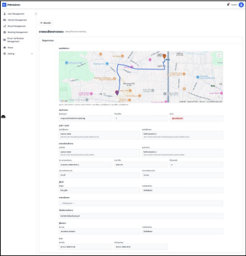

ภาพที่ 57 หน้ารายละเอียดการจอง

# (5) เมนูการจัดการการยืนยันตัวตนผู้ขับขี่ กรณีเป็นผู้ดูแลระบบ
ผู้ดูแลระบบสามารถตรวจสอบรายการการยืนยันตัวตนของผู้ขับขี่ทั้งหมดที่มีอยู่ในระบบได้ โดยแต่
ละรายการจะแสดงข้อมูลพื้นฐาน เช่น ชื่อ–นามสกุลของผู้ใช้ อีเมล หมายเลขโทรศัพท์ หมายเลขใบขับขี่ 
ชื่อ–นามสกุลบนใบขับขี่ ชนิดของใบขับขี่ และสถานะของคําขอ ผู้ดูแลระบบสามารถค้นหาข้อมูลได้จากช่องค้นหา
ด้านบน หรือกรองตามสถานะและชนิดของใบขับขี่ได้ รวมถึงสามารถสร้าง แก้ไข หรือลบข้อมูลคําขอยืนยันตัวตน
ของผู้ใช้ในระบบได้โดยตรง

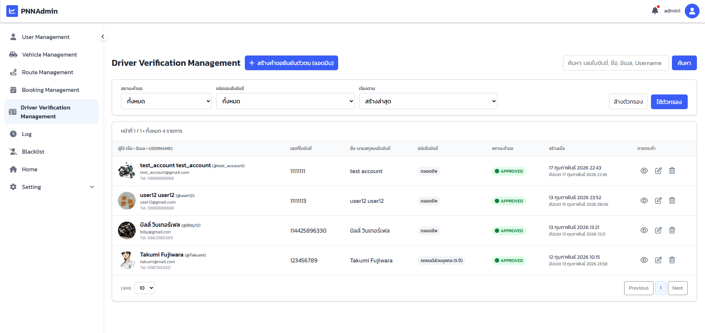

ภาพที่ 57 หน้าการจัดการการยืนยันตัวตนผู้ขับขี่

จากภาพที่ 57 เมื่อเลือกปุ่ม “สร้างคําขอยืนยันตัวตน (แอดมิน)” จะเข้าสู่หน้าสําหรับสร้างคําขอ
ยืนยันตัวตนผู้ขับขี่ ดังภาพที่ 58 โดยผู้ดูแลระบบสามารถเลือกผู้ใช้ที่ต้องการยืนยันตัวตนจากรายชื่อในระบบได้ และ
ต้องอัปโหลดเอกสารหลักฐาน ได้แก่ รูปบัตรขับขี่ประจําตัว (ด้านหน้า) และรูปถ่ายเซลฟี่ของผู้ใช้ เพื่อใช้ในการ
ตรวจสอบความถูกต้องของข้อมูล นอกจากนี้ยังสามารถกรอกข้อมูลเพิ่มเติม เช่น เลขที่ใบขับขี่ ชื่อ–นามสกุลบนบัตร
ประเภทใบขับขี่ วันออกบัตร และวันหมดอายุบัตร เมื่อกรอกข้อมูลครบถ้วนแล้วสามารถกดปุ่ม “สร้างคําขอยืนยัน
ตัวตน” เพื่อบันทึกคําขอลงในระบบ

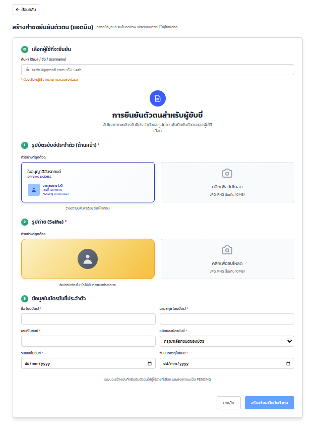

ภาพที่ 58 หน้าสร้างคําขอยืนยันตัวตนใหม่

จากภาพที่ 58 เมื่อเลือกปุ่ม “แก้ไข” จะเข้าสู่หน้าสําหรับปรับแก้ข้อมูลคําขอยืนยันตัวตนของผู้ใช้ ดัง
ภาพที่ 59 โดยหน้าดังกล่าวจะแสดงข้อมูลเดิมทั้งหมด เช่น รูปบัตรขับขี่ รูปถ่ายเซลฟี่ เลขที่ใบขับขี่ ชื่อ–นามสกุลบน
บัตร และวันหมดอายุใบขับขี่ ผู้ดูแลระบบสามารถแก้ไขรายละเอียดหรืออัปโหลดรูปภาพใหม่ได้ จากนั้นกดปุ่ม
“บันทึกการแก้ไข” เพื่อ อัปเดตข้อมูลในระบบให้เป็นปัจจุบัน

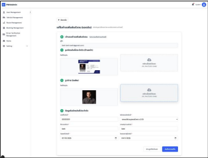

ภาพที่ 59 หน้าสร้างคําขอยืนยันตัวตนใหม่

จากภาพที่ 59 เมื่อเลือกปุ่ม “ดูรายละเอียด” จะเข้าสู่หน้ารายละเอียดของคําขอยืนยันตัวตนผู้ขับขี่
ดังภาพที่ 60 โดยหน้าดังกล่าวจะแสดงข้อมูลผู้ใช้ทั้งหมด เช่น ชื่อ–นามสกุล อีเมล เบอร์โทรศัพท์ ข้อมูลใบขับขี่ รูป
บัตรขับขี่และรูปถ่ายเซลฟี่ของผู้ใช้ ผู้ดูแลระบบสามารถตรวจสอบความถูกต้องของข้อมูลได้อย่างละเอียด และ
สามารถกดปุ่ม “approve” หรือ “reject” เพื่อดําเนินการอนุมัติหรือปฏิเสธคําขอได้ทันที

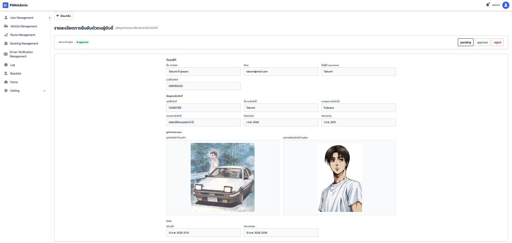

ภาพที่ 60 หน้ารายละเอียดการยืนยันตัวตนผู้ขับขี่