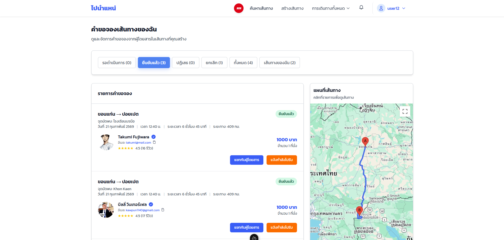
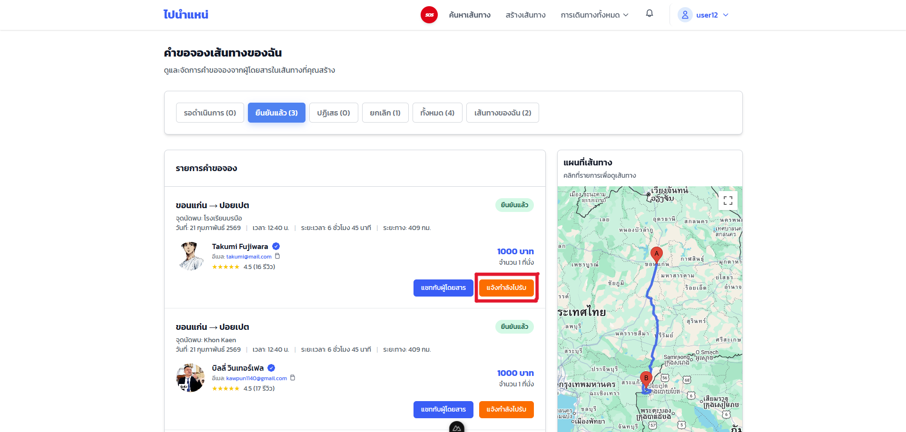
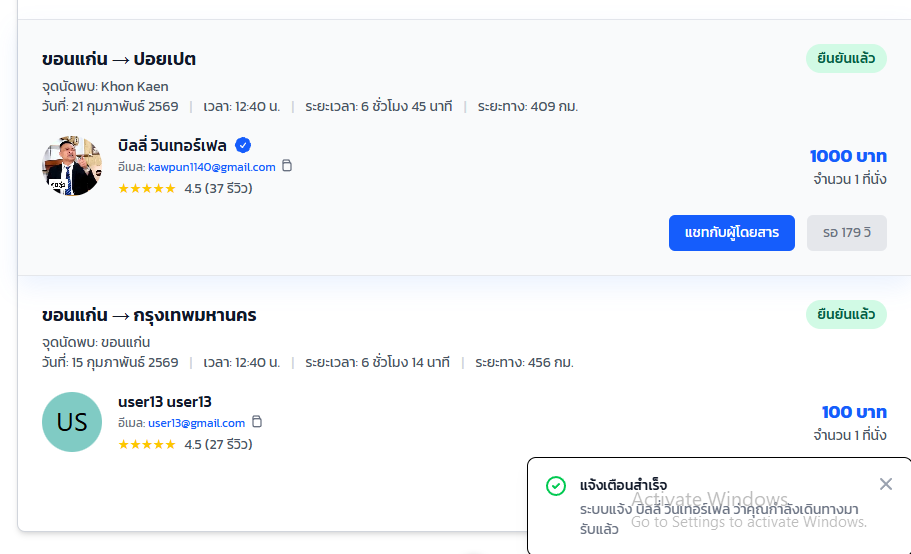
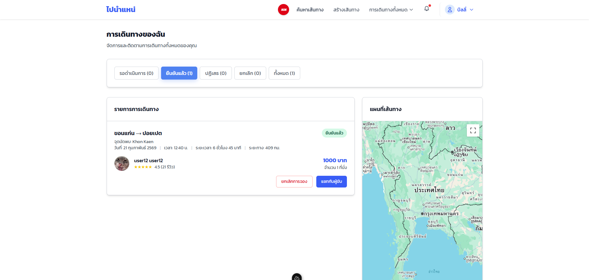
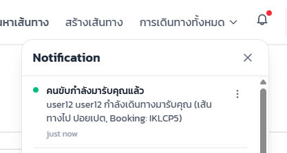
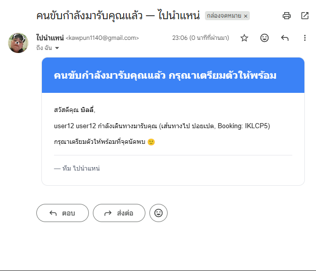

# คู่มือการใช้งานระบบแจ้งเตือนผู้โดยสารจากผู้ขับขี่

## สารบัญ

1. [การแจ้งเตือนผู้โดยสาร (ฝั่งคนขับ)](#1-การแจ้งเตือนผู้โดยสาร-ฝั่งคนขับ)
2. [การติดตามสถานะการรับผู้โดยสาร (ฝั่งผู้โดยสาร)](#2-การติดตามสถานะการรับผู้โดยสาร-ฝั่งผู้โดยสาร)

---

## 1. การแจ้งเตือนผู้โดยสาร (ฝั่งคนขับ)

เมื่อรายการจองเส้นทางได้รับการยืนยันเรียบร้อยแล้ว คุณสามารถแจ้งให้ผู้โดยสารทราบว่าคุณกำลังเดินทางไปรับได้ตามขั้นตอนดังนี้

### ขั้นตอนการใช้งาน

#### ขั้นตอนที่ 1 — เข้าสู่ระบบ

กรอก **ชื่อผู้ใช้หรืออีเมล** และ **รหัสผ่าน** จากนั้นกด **เข้าสู่ระบบ**

---

#### ขั้นตอนที่ 2 — ไปหน้า Dashboard แล้วกดปุ่ม "การเดินทางทั้งหมด" เลือก "คำขอจองเส้นทางของฉัน" แล้วเลือกแท็บ "ยืนยันแล้ว"

---

#### ขั้นตอนที่ 3 — กดปุ่ม "แจ้งกำลังไปรับ"

---

#### หลังจากกดปุ่ม "แจ้งกำลังไปรับ" แล้วจะแสดงข้อความแจ้งเตือนสำเร็จ "ระบบแจ้ง passenger's user name ว่าคุณกำลังเดินทางมารับแล้ว" และต้องรอ 3 นาที ถึงจะกดปุ่มนี้ซ้ำได้อีก (เพื่อป้องกันสแปมข้อความ)

## 2. การติดตามสถานะการรับผู้โดยสาร (ฝั่งผู้โดยสาร)

เมื่อรายการจองของคุณได้รับการยืนยันแล้ว คุณสามารถติดตามความคืบหน้าของคนขับได้ผ่านระบบการแจ้งเตือน ดังนี้

### ขั้นตอนการใช้งาน

#### ขั้นตอนที่ 1 — เข้าสู่ระบบ

กรอก **ชื่อผู้ใช้หรืออีเมล** และ **รหัสผ่าน** จากนั้นกด **เข้าสู่ระบบ**

---

#### ขั้นตอนที่ 2 — ไปหน้า Dashboard แล้วกดปุ่ม "การเดินทางทั้งหมด" เลือก "การเดินทางของฉัน" แล้วเลือกแท็บ "ยืนยันแล้ว" ตรวจสอบสถานะการจองจะต้องได้รับการยืนยันแล้ว

---

#### เมื่อคนขับกดปุ่ม "แจ้งกำลังไปรับ" ระบบจะดำเนินการดังนี้

#### บนหน้าเว็บไซต์: แสดงข้อความแจ้งเตือน (Notification) ทันทีว่า "[ชื่อคนขับ] กำลังเดินทางมารับคุณ (เส้นทาง...)"

#### ผ่านทางอีเมล: ระบบจะส่งอีเมลแจ้งเตือนไปยังที่อยู่อีเมลของคุณโดยอัตโนมัติ เพื่อให้คุณทราบสถานะ แม้ในขณะนั้นคุณไม่ได้เปิดหน้าเว็บไซต์อยู่ก็ตาม
