# คู่มือการใช้งานระบบ

## สารบัญ

1. [การแชทกับผู้โดยสาร (ฝั่งคนขับ)](#1-การแชทกับผู้โดยสาร-ฝั่งคนขับ)
2. [การแจ้งเตือนผู้โดยสาร (ฝั่งคนขับ)](#2-การแจ้งเตือนผู้โดยสาร-ฝั่งคนขับ)
3. [การติดตามสถานะการรับผู้โดยสาร (ฝั่งผู้โดยสาร)](#3-การติดตามสถานะการรับผู้โดยสาร-ฝั่งผู้โดยสาร)
4. [การรายงานคนขับ (ฝั่งผู้โดยสาร)](#4-การรายงานคนขับ-ฝั่งผู้โดยสาร)
5. [การแชร์โลเคชันให้คนที่ไว้ใจหรือบันทึกใน SOS EMERGENCY (ฝั่งผู้โดยสาร)](#5-การแชร์โลเคชันให้คนที่ไว้ใจหรือบันทึกใน-sos-emergency-ฝั่งผู้โดยสาร)
6. [การส่งรีวิวคนขับ (ฝั่งผู้โดยสาร)](#6-การส่งรีวิวคนขับ-ฝั่งผู้โดยสาร)
7. [การสร้างรหัสผ่านใหม่](#7-การสร้างรหัสผ่านใหม่)

---

## 1. การแชทกับผู้โดยสาร (ฝั่งคนขับ)

เมื่อรายการจองเส้นทางได้รับการยืนยันเรียบร้อยแล้ว คุณสามารถแชทกับผู้โดยสารได้ ตามขั้นตอนดังนี้

### ขั้นตอนการใช้งาน

#### ขั้นตอนที่ 1 — เมื่อ Login เข้ามาแล้วกดไปที่ "การเดินทางทั้งหมด" > "คำขอจองเส้นทางของฉัน"

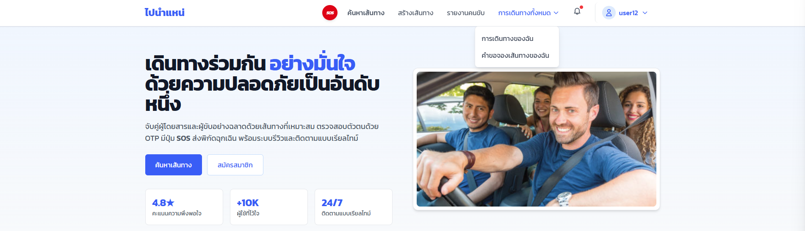

---

#### ขั้นตอนที่ 2 — หน้า "คำขอจองเส้นทางของฉัน" เลือก "ยืนยันแล้ว" จะแสดง "รายการคำขอจอง" สามารถกดปุ่มสีน้ำเงิน "แชทกับผู้โดยสาร" เพื่อเริ่มแชทได้

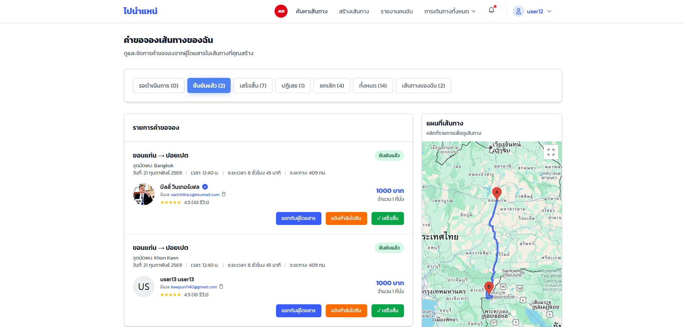

#### ภาพหน้าแชทกับผู้โดยสาร แสดงเฉพาะ "คนขับ" และ "ผู้โดยสาร" ไม่แสดงชื่อจริงของทั้งสองฝ่าย

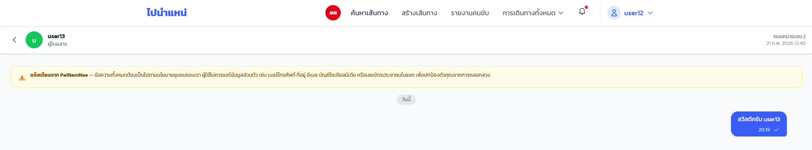

---

## 2. การแจ้งเตือนผู้โดยสาร (ฝั่งคนขับ)

เมื่อรายการจองเส้นทางได้รับการยืนยันเรียบร้อยแล้ว คุณสามารถแจ้งให้ผู้โดยสารทราบว่าคุณกำลังเดินทางไปรับได้ตามขั้นตอนดังนี้

### ขั้นตอนการใช้งาน

#### ขั้นตอนที่ 1 — เมื่อ Login เข้ามาแล้วกดไปที่ "การเดินทางทั้งหมด" > "คำขอจองเส้นทางของฉัน"

---

#### ขั้นตอนที่ 2 — หน้า "คำขอจองเส้นทางของฉัน" เลือก "ยืนยันแล้ว" จะแสดง "รายการคำขอจอง" สามารถกดปุ่มสีส้ม "แจ้งกำลังไปรับ" เพื่อส่งข้อความแจ้งเตือนได้

#### หลังจากกดปุ่ม "แจ้งกำลังไปรับ" แล้วจะแสดงข้อความแจ้งเตือนสำเร็จ "ระบบแจ้ง passenger's user name ว่าคุณกำลังเดินทางมารับแล้ว" และต้องรอ 3 นาที ถึงจะกดปุ่มนี้ซ้ำได้อีก (เพื่อป้องกันสแปมข้อความ)

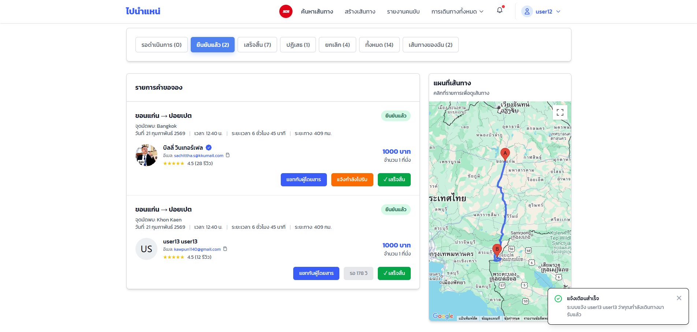

---

## 3. การติดตามสถานะการรับผู้โดยสาร (ฝั่งผู้โดยสาร)

เมื่อรายการจองของคุณได้รับการยืนยันแล้ว คุณสามารถติดตามความคืบหน้าของคนขับได้ผ่านระบบการแจ้งเตือน ดังนี้

### ขั้นตอนการใช้งาน

#### ขั้นตอนที่ 1 — เมื่อ Login เข้ามาแล้วกดไปที่ "Notification" จะแสดงการแจ้งเตือนที่ได้รับ

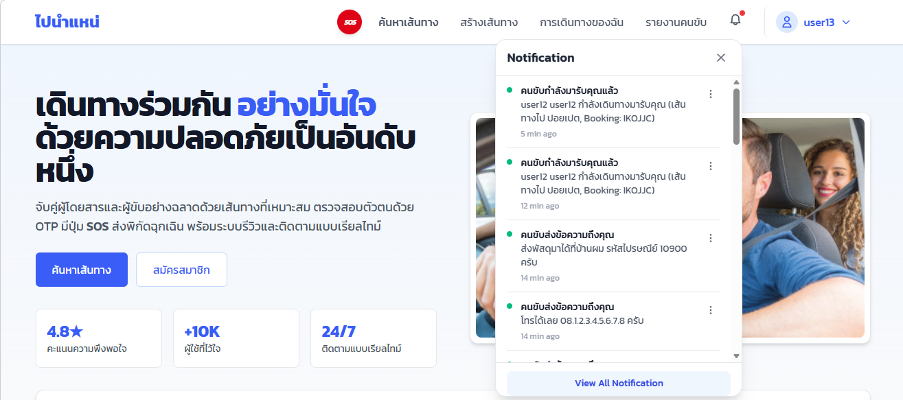

---

## 4. การรายงานคนขับ (ฝั่งผู้โดยสาร)

เมื่อต้องการรายงานคนขับ คุณสามารถทำตามได้ดังนี้

### ขั้นตอนการใช้งาน

#### ขั้นตอนที่ 1 — เมื่อ Login เข้ามาแล้วกดไปที่ "รายงานคนขับ"

---

#### ขั้นตอนที่ 2 — หน้า "รายงานของฉัน" เลือก "สร้างรายงานใหม่" หรือ "สร้างรายงานแรก" ถ้ายังไม่มีรายงาน

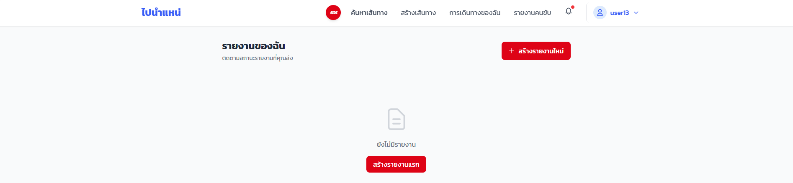

---

#### ขั้นตอนที่ 3 - หน้า "รายงานพฤติกรรมคนขับ" คุณต้องกรอกให้ครบท้วน ก่อนกด "ส่งรายงาน"

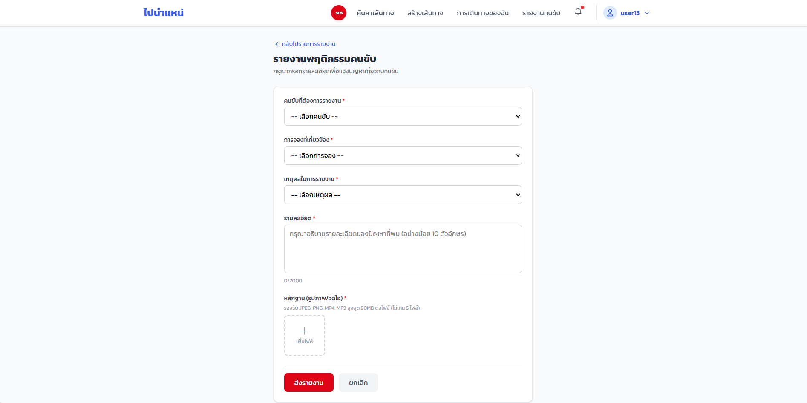

---

#### ขั้นตอนที่ 4 - เมื่อกด "ส่งรายงาน" แล้ว คุณสามารถติดตามสถานะการรายงานได้

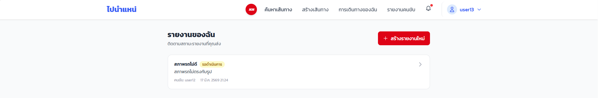

#### ภาพนี้คือหน้า รายละเอียดรายงาน

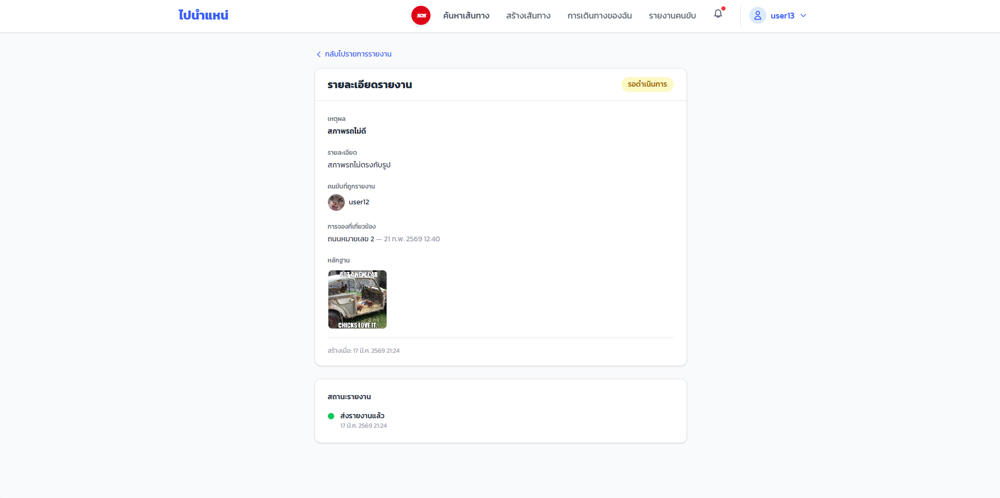

---

## 5. การแชร์โลเคชันให้คนที่ไว้ใจหรือบันทึกใน SOS EMERGENCY (ฝั่งผู้โดยสาร)

เมื่อต้องการส่งโลเคชัน คุณสามารถทำตามได้ดังนี้

### ขั้นตอนการใช้งาน

#### ขั้นตอนที่ 1 — เมื่อ Login เข้ามาแล้วกดไปที่ปุ่ม "SOS"

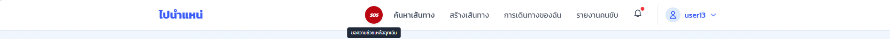

#### ขั้นตอนที่ 2 — คุณสามารถกดปุ่ม "เริ่มแชร์โลเคชัน" เพื่อแชร์โลเคชัน และ ต้องเปิดอนุญาตการแชร์โลเคชันด้วย

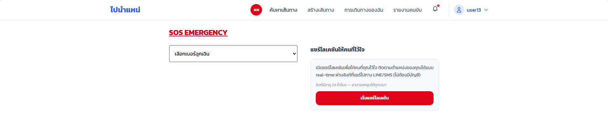

#### ขั้นตอนที่ 3 - เมื่อกดปุ่ม "เริ่มแชร์โลเคชัน" แล้ว คุณสามารถกดปุ่ม "คัดลอกลิงก์", "ส่งลิงก์ผ่าน LINE" หรือ "ส่ง SMS ถึงรายชื่อฉุกเฉินที่บันทึกไว้" ได้ 

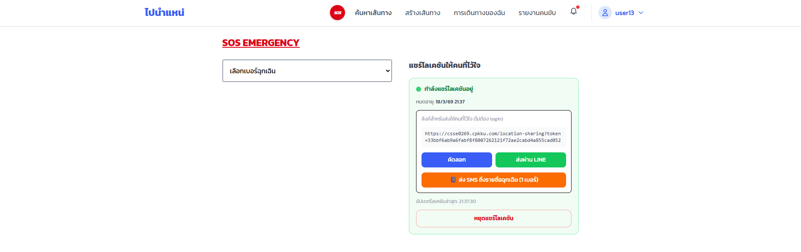

เมื่อต้องการหยุดแชร์โลเคชัน ให้กดปุ่ม "หยุดแชร์โลเคชัน" ได้

#### ขั้นตอนที่ 4 - เมื่อกดปุ่ม "ส่ง SMS ถึงรายชื่อฉุกเฉินที่บันทึกไว้" จะส่งลิงก์ไปหาเบอร์ที่บันทึกไว้ใน EMERGENCY CONTACT

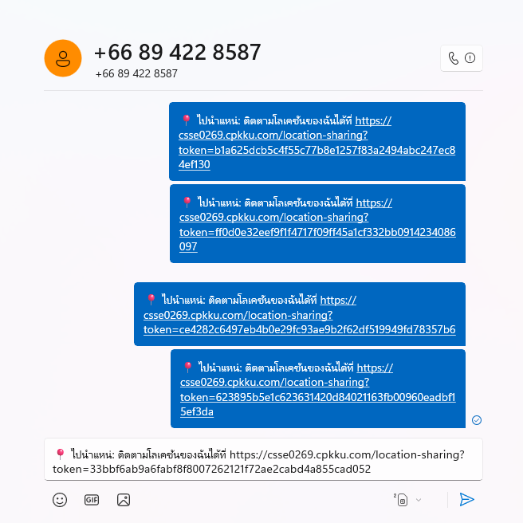

#### เมื่อกดลิงก์ที่สร้าง จะแสดงโลเคชันที่แชร์มา ดังนี้

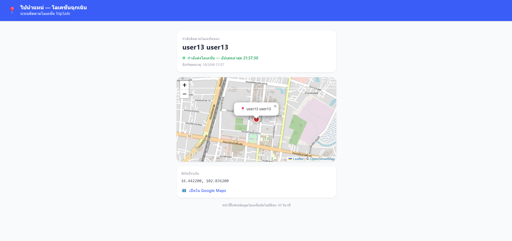

## 6. การส่งรีวิวคนขับ (ฝั่งผู้โดยสาร)

เมื่อคนขับกด "เสร็จสิ้น" แล้ว คุณจะสามารถรีวิวคนขับได้

### ขั้นตอนการใช้งาน

#### ขั้นตอนที่ 1 — เมื่อ Login เข้ามาแล้วกดไปที่ "การเดินทางทั้งหมด" > "การเดินทางของฉัน"

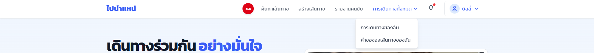

#### ขั้นตอนที่ 2 — หน้า "การเดินทางของฉัน" ที่ "เสร็จสิ้น" จะสามารถให้คะแนน คนขับ ได้

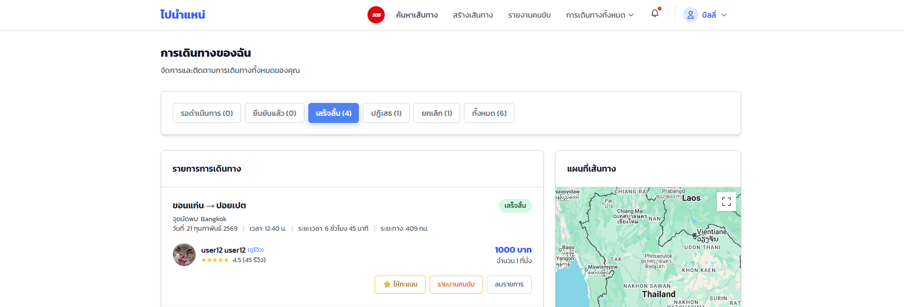

#### ขั้นตอนที่ 3 - หน้า "ให้คะแนนการเดินทาง" คุณสามารถให้ คะแนนความพึงพอใจ และกรอก ความคิดเห็น ได้

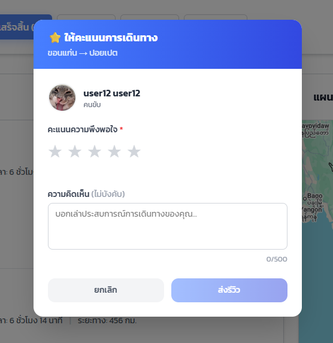

เมื่อกด "ส่งรีวิว" จะขึ้นแจ้งเตือน "ส่งรีวิวสำเร็จ"

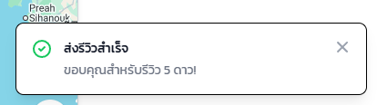

#### ขั้นตอนที่ 4 - เมื่อส่งรีวิวแล้ว จะไม่สามารถกดรีวิวซ้ำได้ และสามารถกด "ดูรีวิว" ได้

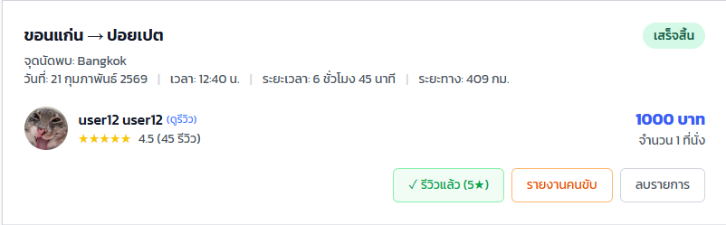

ภาพหน้า "ดูรีวิว" ดังนี้

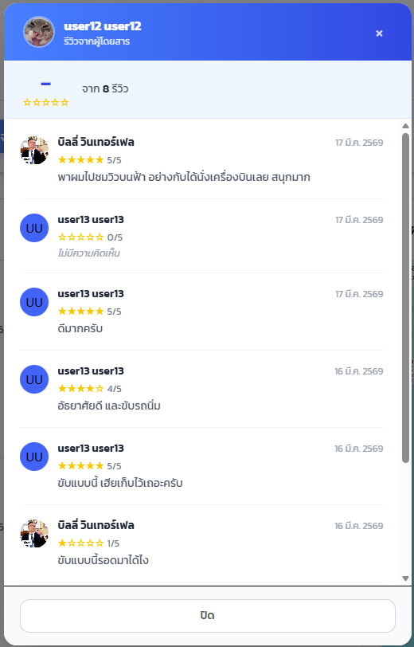

## 7. การสร้างรหัสผ่านใหม่

เมื่อใช้รหัสผ่านเดิมถึง 90 วันแล้ว จำเป็นจะต้องเปลี่ยนรหัสผ่านใหม่ตามหลัก NCSC UK ดังนี้

### ขั้นตอนการใช้งาน

#### ขั้นตอนที่ 1 —  เมื่อ Login เข้ามาแล้วกดไปที่ "บัญชีของฉัน"

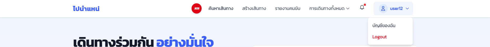

#### ขั้นตอนที่ 2 — หน้า "โปรไฟล์ของฉัน" เลื่อนไปที่ "เปลี่ยนรหัสผ่าน" จากนั้นคุณต้องเลือก จำนวนคำของรหัสผ่าน แล้วกด "สุ่มรหัสผ่าน"

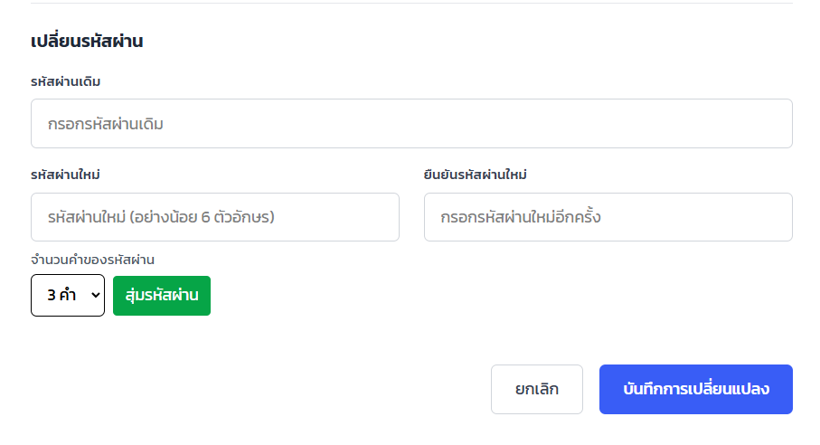

#### ขั้นตอนที่ 2 — เมื่อกด "สุ่มรหัสผ่าน" แล้ว จะได้รหัสผ่านที่แนะนำ มาให้ใส่ในรหัสผ่านใหม่ของคุณ เมื่อกรอกครบแล้ว กด "บันทึกการเปลี่ยนแปลง" เพื่อบันทึกรหัสผ่านใหม่

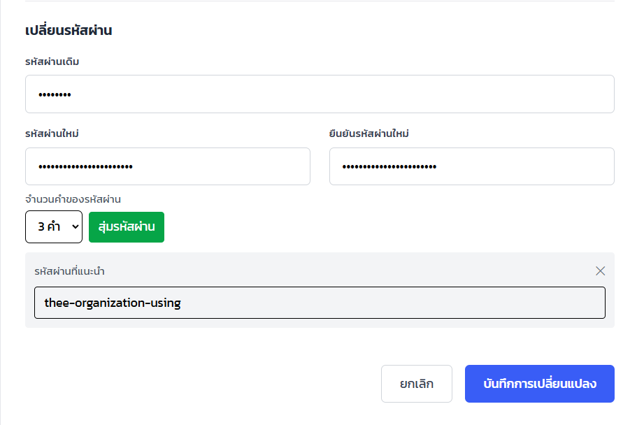